[[the_abc_music_standard_21_dec_2011]]
The abc music standard 2.1 (Dec 2011)
-------------------------------------

 +

[[contents]]
Contents
~~~~~~~~

* link:#introduction[1. Introduction]
** link:#how_to_read_this_document[1.1 How to read this document]
*** link:#terminology_definitions[1.1.1 Terminology / definitions]
** link:#how_to_avoid_reading_this_document[1.2 How to avoid reading
this document]
** link:#abc_tutorials[1.3 Abc tutorials]
** link:#abc_extensions[1.4 Abc extensions]
** link:#further_information_and_changes[1.5 Further information and
changes]
** link:#document_locations[1.6 Document locations]
* link:#abc_files_tunes_and_fragments[2. Abc files, tunes and fragments]
** link:#abc_file_identification[2.1 Abc file identification]
** link:#abc_file_structure[2.2 Abc file structure]
*** link:#abc_tune[2.2.1 Abc tune]
*** link:#file_header[2.2.2 File header]
*** link:#free_text_and_typeset_text[2.2.3 Free text and typeset text]
*** link:#empty_lines_and_line-breaking[2.2.4 Empty lines and
line-breaking]
*** link:#comments_and_remarks[2.2.5 Comments and remarks]
*** link:#continuation_of_input_lines[2.2.6 Continuation of input lines]
** link:#embedded_abc_and_abc_fragments[2.3 Embedded abc and abc
fragments]
*** link:#embedded_abc_fragment[2.3.1 Embedded abc fragment]
*** link:#embedded_abc_tune[2.3.2 Embedded abc tune]
*** link:#embedded_file_header[2.3.3 Embedded file header]
*** link:#embedded_abc_file[2.3.4 Embedded abc file]
* link:#information_fields[3. Information fields]
** link:#description_of_information_fields[3.1 Description of
information fields]
*** link:#xreference_number[3.1.1 X: - reference number]
*** link:#ttune_title[3.1.2 T: - tune title]
*** link:#ccomposer[3.1.3 C: - composer]
*** link:#oorigin[3.1.4 O: - origin]
*** link:#aarea[3.1.5 A: - area]
*** link:#mmeter[3.1.6 M: - meter]
*** link:#lunit_note_length[3.1.7 L: - unit note length]
*** link:#qtempo[3.1.8 Q: - tempo]
*** link:#pparts[3.1.9 P: - parts]
*** link:#ztranscription[3.1.10 Z: - transcription]
*** link:#nnotes[3.1.11 N: - notes]
*** link:#ggroup[3.1.12 G: - group]
*** link:#hhistory[3.1.13 H: - history]
*** link:#kkey[3.1.14 K: - key]
*** link:#rrhythm[3.1.15 R: - rhythm]
*** link:#bdfsbackground_information[3.1.16 B:, D:, F:, S: - background
information]
*** link:#iinstruction[3.1.17 I: - instruction]
*** link:#other_fields[3.1.18 Other fields]
** link:#use_of_fields_within_the_tune_body[3.2 Use of fields within the
tune body]
** link:#field_continuation[3.3 Field continuation]
* link:#the_tune_body[4. The tune body]
** link:#pitch[4.1 Pitch]
** link:#accidentals[4.2 Accidentals]
** link:#note_lengths[4.3 Note lengths]
** link:#broken_rhythm[4.4 Broken rhythm]
** link:#rests[4.5 Rests]
** link:#clefs_and_transposition[4.6 Clefs and transposition]
** link:#beams[4.7 Beams]
** link:#repeat_bar_symbols[4.8 Repeat/bar symbols]
** link:#first_and_second_repeats[4.9 First and second repeats]
** link:#variant_endings[4.10 Variant endings]
** link:#ties_and_slurs[4.11 Ties and slurs]
** link:#grace_notes[4.12 Grace notes]
** link:#duplets_triplets_quadruplets_etc[4.13 Duplets, triplets,
quadruplets, etc.]
** link:#decorations[4.14 Decorations]
** link:#symbol_lines[4.15 Symbol lines]
** link:#redefinable_symbols[4.16 Redefinable symbols]
** link:#chords_and_unisons[4.17 Chords and unisons]
** link:#chord_symbols[4.18 Chord symbols]
** link:#annotations[4.19 Annotations]
** link:#order_of_abc_constructs[4.20 Order of abc constructs]
* link:#lyrics[5. Lyrics]
** link:#alignment[5.1 Alignment]
** link:#verses[5.2 Verses]
** link:#numbering[5.3 Numbering]
* link:#typesetting_and_playback[6. Typesetting and playback]
** link:#typesetting[6.1 Typesetting]
*** link:#typesetting_line-breaks[6.1.1 Typesetting line-breaks]
*** link:#typesetting_extra_space[6.1.2 Typesetting extra space]
*** link:#typesetting_information_fields[6.1.3 Typesetting information
fields]
** link:#playback[6.2 Playback]
* link:#multiple_voices[7. Multiple voices]
** link:#voice_properties[7.1 Voice properties]
** link:#breaking_lines[7.2 Breaking lines]
** link:#inline_fields[7.3 Inline fields]
** link:#voice_overlay[7.4 Voice overlay]
* link:#abc_data_format[8. abc data format]
** link:#tune_body[8.1 Tune body]
** link:#text_strings[8.2 Text strings]
* link:#macros[9. Macros]
** link:#static_macros[9.1 Static macros]
** link:#transposing_macros[9.2 Transposing macros]
* link:#outdated_syntax[10. Outdated syntax]
** link:#outdated_information_field_syntax[10.1 Outdated information
field syntax]
** link:#outdated_dialects[10.2 Outdated dialects]
*** link:#outdated_line-breaking[10.2.1 Outdated line-breaking]
*** link:#outdated_decorations[10.2.2 Outdated decorations]
*** link:#outdated_chords[10.2.3 Outdated chords]
** link:#outdated_continuations[10.3 Outdated continuations]
** link:#outdated_directives[10.4 Outdated directives]
** link:#outdated_file_structure[10.5 Outdated file structure]
*** link:#outdated_tune_header_syntax[10.5.1 Outdated tune header
syntax]
*** link:#outdated_defaults[10.5.1 Outdated defaults]
** link:#outdated_lyrics_alignment[10.6 Outdated lyrics alignment]
** link:#other_outdated_syntax[10.7 Other outdated syntax]
*** link:#disallowed_voice_overlay[10.7.1 Disallowed voice overlay]
* link:#stylesheet_directives_and_pseudo-comments[11. Stylesheet
directives and pseudo-comments]
** link:#introduction_to_directives[11.0 Introduction to directives]
*** link:#disclaimer[11.0.1 Disclaimer]
*** link:#stylesheet_directives[11.0.2 Stylesheet directives]
** link:#voice_grouping[11.1 Voice grouping]
** link:#instrumentation_directives[11.2 Instrumentation directives]
** link:#accidental_directives[11.3 Accidental directives]
** link:#formatting_directives[11.4 Formatting directives]
*** link:#page_format_directives[11.4.1 Page format directives]
*** link:#font_directives[11.4.2 Font directives]
*** link:#space_directives[11.4.3 Space directives]
*** link:#measure_directives[11.4.4 Measure directives]
*** link:#text_directives[11.4.5 Text directives]
*** link:#information_directives[11.4.6 Information directives]
*** link:#separation_directives[11.4.7 Separation directives]
*** link:#miscellaneous_directives[11.4.8 Miscellaneous directives]
** link:#application_specific_directives[11.5 Application specific
directives]
** link:#further_information_about_directives[11.6 Further information
about directives]
* link:#dialects_strict_loose_interpretation_and_backwards_compatibility[12.
Dialects, strict / loose interpretation and backwards compatibility]
** link:#dialect_differences[12.1 Dialect differences]
*** link:#line-breaking_dialects[12.1.1 Line-breaking dialects]
*** link:#decoration_dialects[12.1.2 Decoration dialects]
*** link:#chord_dialects[12.1.3 Chord dialects]
** link:#loose_interpretation[12.2 Loose interpretation]
** link:#strict_interpretation[12.3 Strict interpretation]
* link:#sample_abc_tunes[13. Sample abc tunes]
** link:#englishabc[13.1 English.abc]
** link:#strspysabc[13.2 Strspys.abc]
** link:#reelsabc[13.3 Reels.abc]
** link:#canzonettaabc[13.4 Canzonetta.abc]
* link:#appendix[14. Appendix]
** link:#supported_accents_ligatures[14.1 Supported accents & ligatures]
** link:#errata[14.2 Errata]

'''''

[[introduction]]
1. Introduction
~~~~~~~~~~~~~~~

Abc is a text-based music notation system designed to be comprehensible
by both people and computers. Music notated in abc is written using
characters - letter, digits and punctuation marks - on paper or in
computer files.

This description of abc has been created for those who wish to
understand the notation, and for implementers of abc software
applications. Some example tunes are included in
link:#sample_abc_tunes[sample abc tunes].

[[how_to_read_this_document]]
1.1 How to read this document
^^^^^^^^^^^^^^^^^^^^^^^^^^^^^

Start at the beginning and work through to the end. Alternatively, for
selected highlights, take a look at
link:#how_to_avoid_reading_this_document[how to avoid reading this
document].

[[terminology_definitions]]
1.1.1 Terminology / definitions
+++++++++++++++++++++++++++++++

Note that the following terms have specific meanings in the context of
the abc standard. For convenience, each time one of these terms is used
in the standard it is linked to the section in which it is defined:

* link:#abc_file_definition[abc file]
* link:#abc_fragment_definition[abc fragment]
* link:#abc_tune_definition[abc tune]
* link:#abc_tunebook_definition[abc tunebook]
* link:#code_line-break_definition[code line-break]
* link:#comment_definition[comment]
* link:#embedded_definition[embedded]
* link:#empty_line_definition[empty line]
* link:#file_header_definition[file header]
* link:#free_text_definition[free text]
* link:#information_field_definition[information field]
* link:#inline_field_definition[inline field]
* link:#music_code_definition[music code]
* link:#score_line-break_definition[score line-break]
* link:#stylesheet_directive_definition[stylesheet directive]
* link:#text_string_definition[text string]
* link:#tune_body_definition[tune body]
* link:#tune_header_definition[tune header]
* link:#typeset_text_definition[typeset text]

Please see also http://www.ietf.org/rfc/rfc2119.txt for formal
definitions of the key words MUST, MUST NOT, REQUIRED, SHALL, SHALL NOT,
SHOULD, SHOULD NOT, RECOMMENDED, MAY, and OPTIONAL.

Finally, the word _VOLATILE_ is used to indicate sections which are
under active discussion and/or likely to change in some future version
of the standard.

[[how_to_avoid_reading_this_document]]
1.2 How to avoid reading this document
^^^^^^^^^^^^^^^^^^^^^^^^^^^^^^^^^^^^^^

The abc standard contains a lot of information, much of which will not
be immediately useful to the beginner. Apart from reading this section,
link:#introduction[1. Introduction], newcomers are recommended to
familiarise themselves with all of link:#abc_file_structure[2.2 Abc file
structure], link:#information_fields[3.0 Information fields], a few
subsections in link:#description_of_information_fields[3.1 Description
of information fields] (in particular link:#xreference_number[3.1.1],
link:#ttune_title[3.1.2], link:#mmeter[3.1.6],
link:#lunit_note_length[3.1.7] and link:#kkey[3.1.14]),
link:#use_of_fields_within_the_tune_body[3.2 Use of fields within the
tune body], and as much of section link:#the_tune_body[4. The tune body]
as is desired (but in particular link:#pitch[4.1],
link:#note_lengths[4.3], link:#beams[4.7],
link:#repeat_bar_symbols[4.8]).

Newcomers are also advised to take a look at section
link:#sample_abc_tunes[13. Sample abc tunes] and one of the
link:#abc_tutorials[abc tutorials] that is available.

After that, it may depend on what you want to use abc for, but further
reading suggestions would be:

* link:#lyrics[5. Lyrics] for transcribing songs
* link:#typesetting[6.1 Typesetting] for printing abc transcriptions in
staff notation
* link:#multiple_voices[7. Multiple voices] for working with multi-voice
music

[[abc_tutorials]]
1.3 Abc tutorials
^^^^^^^^^^^^^^^^^

This document is also best read in conjunction with an introduction to
abc notation. Several are available - see, for example:

* http://abcnotation.com/learn - a number of tutorials are linked from
here
* http://abcplus.sourceforge.net/#ABCGuide
* http://www.lesession.co.uk/abc/abc_notation.htm
* http://trillian.mit.edu/~jc/music/abc/doc/ABCtutorial.html

[[abc_extensions]]
1.4 Abc extensions
^^^^^^^^^^^^^^^^^^

Since the abc notation system was originally written, a large number of
abc software packages (programs which: produce printed sheet music; play
or create audio files, usually MIDI; search or organise tune databases;
or that analyse or manipulate tunes in some way) have been developed.
However, not all of them follow this standard absolutely. This document
aims at solving, or at least reducing, the problem of incompatibility
between applications.

Nevertheless, when using abc it is good to be aware of the existence of
such extensions. Extensions implemented by some major abc packages are
described at the following links:

* http://moinejf.free.fr/abcm2ps-features.txt - extensions implemented
by http://abcnotation.com/software#abcm2ps[abcm2ps]
* http://abc.sourceforge.net/standard/abc2midi.txt - extensions
implemented by http://abcnotation.com/software#abcMIDI[abc2midi]
* http://www.barfly.dial.pipex.com/bfextensions.html - extensions
implemented by http://abcnotation.com/software#BarFly[BarFly]
* http://www.lautengesellschaft.de/cdmm/userguide/userguide.html -
extensions implemented by
http://abcnotation.com/software#abctab2ps[abctab2ps]

[[further_information_and_changes]]
1.5 Further information and changes
^^^^^^^^^^^^^^^^^^^^^^^^^^^^^^^^^^^

Questions about this standard, or abc in general, can be addressed to
the abcusers e-mail list, or the abcnotation forums:

* http://groups.yahoo.com/group/abcusers/ (abcusers - subscriptions and
archive of posts)
* http://www.mail-archive.com/abcusers@argyll.wisemagic.com/ (abcusers -
archive of old posts)
* http://abcnotation.com/forums/

To propose changes to the standard, please read

* http://abcnotation.com/wiki/abc:standard:route-map - a route map of
proposed changes to the standard plus instructions for proposing changes

[[document_locations]]
1.6 Document locations
^^^^^^^^^^^^^^^^^^^^^^

This document can be found at:

* http://abcnotation.com/wiki/abc:standard:v2.1

The latest version of the standard, plus links to older versions and
other developmental work, can always be found via:

* http://abcnotation.com/wiki/abc:standard

'''''

[[abc_files_tunes_and_fragments]]
2. Abc files, tunes and fragments
~~~~~~~~~~~~~~~~~~~~~~~~~~~~~~~~~

Tunes written in abc are normally stored in
link:#abc_file_definition[abc files], either on a computer's hard-drive
or linked from a web-page. However, an increasing number are found on
web-pages or in databases.

This section describes the basic structure of
link:#abc_file_definition[abc files] and link:#abc_tune_definition[abc
tunes], as well as a definition for including fragments of abc tunes
elsewhere (e.g. web-pages).

[[abc_file_identification]]
2.1 Abc file identification
^^^^^^^^^^^^^^^^^^^^^^^^^^^

All link:#abc_file_definition[abc files] should have the extension
".abc" (all lower-case) on all platforms.

_Comment:_ Some web-servers only allow a limited selection of file
types; in this case a ".txt" extension is the best alternative.

Every link:#abc_file_definition[abc file] should begin with the string
`%abc`. An optional version number may follow on the same line, e.g.

[source,code]
----
%abc-2.1
----

Version numbers of 2.1 or higher indicate that the
link:#abc_file_definition[abc file] is to be
link:#strict_interpretation[interpreted strictly] according to the
corresponding abc standard; if the version number is missing, the file
will be treated under link:#loose_interpretation[loose interpretation].
The link:#version_field[version field] may also be used to indicate abc
versions for individual tunes.

_Note for developers:_ Software should ignore the
http://en.wikipedia.org/wiki/Byte_order_mark[byte order mark] (BOM) if
encountered as the first character of the file.

When an link:#abc_file_definition[abc file] is included in a multi-part
e-mail, its MIME type must be "text/vnd.abc" (see
http://www.iana.org/assignments/media-types/text/vnd.abc[IANA
text/vnd.abc]).

[[abc_file_structure]]
2.2 Abc file structure
^^^^^^^^^^^^^^^^^^^^^^

An *abc file* consists of one or more
link:#abc_tune_definition[abc tune] transcriptions, optionally
interspersed with link:#free_text_definition[free text] and
link:#typeset_text_definition[typeset text] annotations. It may
optionally start with a link:#file_header_definition[file header] to set
up default values for processing the file.

The link:#file_header_definition[file header],
link:#abc_tune_definition[abc tunes] and
link:#free_text_and_typeset_text[text annotations] are separated from
each other by link:#empty_line_definition[empty lines] (also known as
blank lines).

An link:#abc_file_definition[abc file] with more than one tune in
it is called an **abc tunebook**.

[[abc_tune]]
2.2.1 Abc tune
++++++++++++++

An *abc tune* itself consists of a
link:#tune_header_definition[tune header] and a
link:#tune_body_definition[tune body], terminated by an
link:#empty_line_definition[empty line] or the end of the
link:#abc_file_definition[file]. It may also contain
link:#comment_definition[comment lines] or
link:#stylesheet_directive_definition[stylesheet directives].

The *tune header* is composed of several
link:#information_field_definition[information field] lines, which are
further discussed in link:#information_fields[information fields]. The
link:#tune_header_definition[tune header] should start with an
`X:`(reference number) field followed by a `T:`(title) field and finish
with a `K:`(key) field.

The **tune body**, which contains the
link:#music_code_definition[music code], follows immediately after.
Certain fields may also be used inside the tune body - see
link:#use_of_fields_within_the_tune_body[use of fields within the tune
body].

It is legal to write an link:#abc_tune_definition[abc tune] without a
link:#tune_body_definition[tune body]. This feature can be used to
document tunes without transcribing them.

Abc *music code* lines are those lines in the
link:#tune_body_definition[tune body] which give notes, bar lines and
other musical symbols - see link:#the_tune_body[the tune body] for
details. In effect, music code is the contents of any line which is not
an link:#information_field_definition[information field],
link:#stylesheet_directive_definition[stylesheet directive] or
link:#comment_definition[comment line].

[[file_header]]
2.2.2 File header
+++++++++++++++++

The file may optionally start with a *file header* (immediately
after the version field), consisting of a block of consecutive
link:#information_field_definition[information fields],
link:#stylesheet_directive_definition[stylesheet directives], or both,
terminated with an link:#empty_line_definition[empty line]. The
link:#file_header_definition[file header] is used to set default values
for the tunes in the file.

The link:#file_header_definition[file header] may only appear at the
beginning of a file, not between tunes.

Settings in a tune may override the link:#file_header_definition[file
header] settings, but when the end of a tune is reached the defaults set
by the link:#file_header_definition[file header] are reinstated.

Applications which extract separate tunes from a file must insert the
fields of the original link:#file_header_definition[file header] into
the header of the extracted tune. However, since users may manually
extract tunes without regard to the link:#file_header_definition[file
header], it is not recommended to use a
link:#file_header_definition[file header] in an
link:#abc_tunebook_definition[abc tunebook] that is to be distributed.

[[free_text_and_typeset_text]]
2.2.3 Free text and typeset text
++++++++++++++++++++++++++++++++

The terms link:#free_text_definition[free text] and
link:#typeset_text_definition[typeset text] refer to any text not
directly included within the
link:#information_field_definition[information fields] in a
link:#tune_header_definition[tune header]. Typically such text is used
for annotating link:#abc_tunebook_definition[abc tunebooks];
link:#free_text_definition[free text] is for annotating the
link:#abc_file_definition[abc file] but is not included in the typeset
score, whereas link:#typeset_text_definition[typeset text] is intended
for printing out.

**Free text** is just that. It can be included anywhere in an
link:#abc_file_definition[abc file], after the
link:#file_header_definition[file header], but must be separated from
link:#abc_tune_definition[abc tunes],
link:#typeset_text_definition[typeset text] and the
link:#file_header_definition[file header] by
link:#empty_line_definition[empty lines]. Typically it is used for
annotating the link:#abc_file_definition[abc file] but in principle can
be any text not containing
link:#information_field_definition[information fields].

_Comment:_ Since raw html markup and email headers are treated as
link:#free_text_definition[free text] (provided they don't inadvertently
contain link:#information_field_definition[information fields]) this
means that abc software can process a wide variety of text-based input
files just by ignoring non-abc code.

By default link:#free_text_definition[free text] is not included in the
printed score, although typesetting software may offer the option to
print it out (e.g. via a command line switch or GUI checkbox). In this
case, the software should treat the link:#free_text_definition[free
text] as a link:#text_string_definition[text string], but may format it
in any way it chooses.

**Typeset text** is any text specified using
link:#text_directives[text directives]. It may be inserted anywhere in
an link:#abc_file_definition[abc file] after the
link:#file_header_definition[file header], either separated from tunes
by link:#empty_line_definition[empty lines], or included in the
link:#tune_header_definition[tune header] or
link:#tune_body_definition[tune body].

link:#typeset_text_definition[Typeset text] should be printed by
typesetting programs although its exact position in the printed score is
program-dependent.

link:#typeset_text_definition[Typeset text] that is included in an
link:#abc_tune_definition[abc tune] (i.e. within the
link:#tune_header_definition[tune header] or
link:#tune_body_definition[tune body]), must be retained by any
programs, such as databasing software, that splits an
link:#abc_file_definition[abc file] into separate
link:#abc_tune_definition[abc tunes].

[[empty_lines_and_line-breaking]]
2.2.4 Empty lines and line-breaking
+++++++++++++++++++++++++++++++++++

**Empty lines** (also known as blank lines) are used to separate
link:#abc_tune_definition[abc tunes], link:#free_text_definition[free
text] and the link:#file_header_definition[file header]. They also aid
the readability of link:#abc_file_definition[abc files].

Lines that consist entirely of white-space (space and tab characters)
are also regarded as link:#empty_line_definition[empty lines].

Line-breaks (also known as new lines, line feeds, carriage returns,
end-of-lines, etc.) can be used within an link:#abc_file_definition[abc
file] to aid readability and, if required, break up long input lines -
see link:#continuation_of_input_lines[continuation of input lines].

More specifically, line-breaks in the link:#music_code_definition[music
code] can be used to structure the abc transcription and, by default,
generate line-breaks in the printed music. For more details see
link:#typesetting_line-breaks[typesetting line-breaks].

[[comments_and_remarks]]
2.2.5 Comments and remarks
++++++++++++++++++++++++++

A percent symbol (`%`) will cause the remainder of any input line
to be ignored. It can be used to add a *comment* to the end of an abc
line or as a *comment line* in its own right. (To get a percent symbol,
type `\%` - see link:#text_strings[text strings].)

Alternatively, you can use the syntax `[r:remark]` to write a
*remark* in the middle of a line of music.

_Example:_

[source,code]
----
|:DEF FED| % this is an end of line comment
% this is a comment line
DEF [r:and this is a remark] FED:|
----

Abc code which contains link:#comment_definition[comments] and remarks
should be processed in exactly the same way as it would be if all the
link:#comment_definition[comments] and link:#remark_definition[remarks]
were removed (although, if the code is preprocessed, and
link:#comment_definition[comments] are actually removed, the
link:#stylesheet_directive_definition[stylesheet directives] should be
left in place).

Important clarification: lines which just contain a
link:#comment_definition[comment] are processed as if the entire line
were removed, even if the link:#comment_definition[comment] is preceded
by white-space (i.e. the `%` symbol is the not first character). In
other words, removing the link:#comment_definition[comment] effectively
removes the entire line and so no link:#empty_line_definition[empty
line] is introduced.

[[continuation_of_input_lines]]
2.2.6 Continuation of input lines
+++++++++++++++++++++++++++++++++

It is sometimes necessary to tell abc software that an input line is
continued on the next physical line(s) in the
link:#abc_file_definition[abc file], so that the two (or more) lines are
treated as one. In abc 2.0 there was a universal continuation character
(see link:#outdated_continuations[outdated continuations]) for this
purpose, but it was decided that this was both unnecessary and
confusing.

In abc 2.1, there are ways of continuing each of the 4 different input
line types: link:#music_code_definition[music code],
link:#information_field_definition[information fields],
link:#comment_definition[comments] and
link:#stylesheet_directive_definition[stylesheet directives].

In abc link:#music_code_definition[music code], by default, line-breaks
in the code generate line-breaks in the typeset score and these can be
suppressed by using a backslash (or by telling abc typesetting software
to ignore line-breaks using `I:linebreak $` or `I:linebreak <none>`) -
see link:#typesetting_line-breaks[typesetting line-breaks] for full
details.

_Comment for programmers:_ The backslash effectively acts as a
continuation character for link:#music_code_definition[music code]
lines, although, for those used to encountering it in other computer
language contexts, its use is very abc-specific. In particular it can
continue link:#music_code_definition[music code] lines through
link:#information_field_definition[information fields],
link:#comment_definition[comments] and
link:#stylesheet_directive_definition[stylesheet directives].

The 3 other input line types can be continued as follows:

* link:#information_field_definition[information fields] can be
continued using `+:` at the start of the following line - see
link:#field_continuation[field continuation];
* link:#comment_definition[comments] can easily be continued by adding a
`%` symbol at the start of the following line - since they are ignored
by abc software it doesn't matter how many lines they are split into;
* most link:#stylesheet_directive_definition[stylesheet directives] are
too short to require a continuation syntax, but if one is required then
use the `I:<directive>` form (see `I:instruction`), in place of
`%%<directive>` and continue the line as a field - see
link:#field_continuation[field continuation].

_Comment for developers:_ Unlike other languages, and because of the way
in which both link:#information_field_definition[information fields] and
link:#music_code_definition[music code] can be continued through
link:#comment_definition[comments],
link:#stylesheet_directive_definition[stylesheet directives] and (in the
case of link:#music_code_definition[music code])
link:#information_field_definition[information fields], it is generally
not possible to parse link:#abc_file_definition[abc files] by
pre-processing continuations into single lines.

Note that, with the exception of abc link:#music_code_definition[music
code], continuations are unlikely to be needed often. Indeed in most
cases it should be possible, although not necessarily desirable, to
write very long input lines, since most abc editing software will
display them as wrapped within the text editor window.

_Recommendation:_ Despite there being no limit on line length in
link:#abc_file_definition[abc files], it is recommended that users avoid
writing abc code with very long lines. In particular, judiciously
applied line-breaks can aid the (human) readability of abc code. More
importantly, users who send link:#abc_tune_definition[abc tunes] with
long lines should be aware that email software sometimes introduces
additional line-breaks into lines with more than 72 characters and these
may even cause errors when the resulting tune is processed.

[[embedded_abc_and_abc_fragments]]
2.3 Embedded abc and abc fragments
^^^^^^^^^^^^^^^^^^^^^^^^^^^^^^^^^^

Traditionally abc has been used in dedicated
link:#abc_file_definition[abc files]. More recently, however, the
possibility has arisen to include link:#abc_tune_definition[abc tunes],
and even fragments, within other document types. An abc element included
within another document type is referred to as *embedded* in that
document.

Often, although not always, some form of markup is used to indicate
where the link:#embedded_definition[embedded] abc code starts and
finishes.

_Example:_ Within an html document a tune could be included as follows:

[source,code]
----
<pre class="abc-tune">
X:1
T:Title
K:C
DEF FED:|
</pre>
----

_Important note:_ The abc standard makes no stipulation about _how_ the
abc code is included in the document. For example, in html it could be
via a `<pre>`, `<div>`, `<object>`, `<script>` or some other tag.

link:#embedded_definition[Embedded] abc elements can be one of four
types:

* an link:#abc_fragment_definition[abc fragment]
* an link:#abc_tune_definition[abc tune]
* a link:#file_header_definition[file header]
* an entire link:#abc_file_definition[abc file]

In all cases, the type must be indicated to the abc parsing code which
is going to process it (for example, via a `class` parameter). An
exception is the link:#embedded_definition[embedded]
link:#abc_tune_definition[abc tune] where the parser may instead use the
`X:` field to identify it.

The following rules are applied to link:#embedded_definition[embedded]
elements:

[[embedded_abc_fragment]]
2.3.1 Embedded abc fragment
+++++++++++++++++++++++++++

An **abc fragment** is a partial link:#abc_tune_definition[abc
tune]. It may contain a partial link:#tune_header_definition[tune
header] with no body or a link:#tune_body_definition[tune body] with
optional link:#tune_header_definition[tune header]
link:#information_field_definition[information fields].

_Example 1:_ A fragment with no link:#tune_header_definition[tune
header]:

[source,code]
----
<div class="abc-fragment">
CDEF GABc|
</div>
----

_Example 2:_ A fragment with a partial link:#tune_header_definition[tune
header]:

[source,code]
----
<div class="abc-fragment">
T:Major scale in D
K:D
DEFG ABcd|
</div>
----

Unless `T:`, `M:` and `K:` fields are present, a fragment is assumed to
describe a stave in the treble clef with no title, no meter indication
and no key signature, respectively.

An link:#abc_fragment_definition[abc fragment] does not require an
link:#empty_line_definition[empty line] to mark the end of the
link:#tune_body_definition[tune body] if it is terminated by the
document markup.

_Note for developers:_ For processing as an
link:#abc_tune_definition[abc tune], the parsing code is notionally
assumed to add empty `X:`, `T:` and `K:` fields, if these are missing.
However, since the processing generally takes place internally within a
software package, these need not be added in actuality.

[[embedded_abc_tune]]
2.3.2 Embedded abc tune
+++++++++++++++++++++++

An link:#embedded_definition[embedded] link:#abc_tune_definition[abc
tune] has the same structure as an ordinary
link:#abc_tune_definition[abc tune] except that it does not require an
link:#empty_line_definition[empty line] to mark the end of the
link:#tune_body_definition[tune body].

An link:#embedded_definition[embedded] link:#abc_tune_definition[abc
tune] could also be identified as an link:#abc_fragment_definition[abc
fragment] (albeit complete), if preferred.

[[embedded_file_header]]
2.3.3 Embedded file header
++++++++++++++++++++++++++

As with the link:#file_header_definition[file header], an
link:#embedded_definition[embedded] link:#file_header_definition[file
header] can be used to set default values for all
link:#embedded_definition[embedded] abc tunes and
link:#abc_fragment_definition[abc fragments] within the document.

_Example:_ For setting the title font in every
link:#abc_tune_definition[abc tune] in the document:

[source,code]
----
<div class="abc-file-header">
%%titlefont Arial 10
</div>
----

Like its counterpart, there must only be one
link:#embedded_definition[embedded] link:#file_header_definition[file
header] per document and it should precede all other
link:#embedded_definition[embedded] abc tunes and
link:#abc_fragment_definition[abc fragments].

[[embedded_abc_file]]
2.3.4 Embedded abc file
+++++++++++++++++++++++

A document may include an entire link:#embedded_definition[embedded]
link:#abc_file_definition[abc file] with the usual structure - see
link:#abc_file_structure[abc file structure].

An link:#embedded_definition[embedded] link:#abc_file_definition[abc
file] should be treated independently from other
link:#embedded_definition[embedded] elements so that settings in one
link:#embedded_definition[embedded] link:#abc_file_definition[abc file]
do not affect other link:#embedded_definition[embedded] elements.

_Recommendation:_ As a consequence, using other
link:#embedded_definition[embedded] elements in a document that contains
an link:#embedded_definition[embedded] link:#abc_file_definition[abc
file] is not recommended.

'''''

[[information_fields]]
3. Information fields
~~~~~~~~~~~~~~~~~~~~~

Any line beginning with a letter in the range `A-Z` or `a-z` and
immediately followed by a colon (`:`) is an **information field**.
Information fields are used to notate things such as composer, meter,
etc. In fact anything that isn't music.

An link:#information_field_definition[information field] may also be
inlined in a link:#tune_body_definition[tune body] when enclosed by `[`
and `]` - see link:#use_of_fields_within_the_tune_body[use of fields
within the tune body].

Many of these link:#information_field_definition[information field]
identifiers are currently unused so, in order to extend the number of
link:#information_field_definition[information fields] in the future,
programs that comply with this standard must ignore the occurrence of
link:#information_field_definition[information fields] not defined here
(although they should give a non-fatal error message to warn the user,
in case the field identifier is an error or is unsupported).

Some link:#information_field_definition[information fields] are
permitted only in the file or link:#tune_header_definition[tune header]
and some only in the link:#tune_body_definition[tune body], while others
are allowed in both locations.
link:#information_field_definition[information field] identifiers `A-G`,
`X-Z` and `a-g`, `x-z` are not permitted in the body to avoid confusion
with link:#pitch[note symbols], link:#rests[rests] and
link:#typesetting_extra_space[spacers].

Users who wish to use abc notation solely for transcribing (rather than
documenting) tunes can ignore most of the
link:#information_field_definition[information fields]. For this purpose
all that is really needed are the `X:`(reference number), `T:`(title),
`M:`(meter), `L:`(unit note length) and `K:`(key)
link:#information_field_definition[information fields], plus if
applicable `C:`(composer) and `w:` or `W:` (words/lyrics, respectively
within or after the tune).

_Recommendation for newcomers:_ A good way to find out how to use the
fields is to look at the example files, link:#sample_abc_tunes[sample
abc tunes] (in particular link:#englishabc[English.abc]), and try out
some examples.

The link:#information_field_definition[information fields] are
summarised in the following table and discussed in
link:#description_of_information_fields[description of information
fields] and elsewhere.

The table illustrates how the
link:#information_field_definition[information fields] may be used in
the link:#tune_header_definition[tune header] and whether they may also
be used in the link:#tune_body_definition[tune body] (see
link:#use_of_fields_within_the_tune_body[use of fields within the tune
body] for details) or in the link:#file_header_definition[file header]
(see link:#abc_file_structure[abc file structure]).

Abc Fields and their usage:

[cols=",,,,,,",options="header",]
|=======================================================================
|Field name |link:#file_header_definition[file header]
|link:#tune_header_definition[tune header]
|link:#tune_body_definition[tune body]
|link:#inline_field_definition[inline] |type |Examples and notes
|link:#aarea[A:area] |yes |yes | | |string |A:Donegal, A:Bampton
(link:#outdated_information_field_syntax[deprecated])

|link:#bdfsbackground_information[B:book] |yes |yes | | |string
|B:O'Neills

|link:#ccomposer[C:composer] |yes |yes | | |string |C:Robert Jones,
C:Trad.

|link:#bdfsbackground_information[D:discography] |yes |yes | | |string
|D:Chieftains IV

|link:#bdfsbackground_information[F:file url] |yes |yes | | |string
|F:http://a.b.c/file.abc

|link:#ggroup[G:group] |yes |yes | | |string |G:flute

|link:#hhistory[H:history] |yes |yes | | |string |H:The story behind
this tune …

|link:#iinstruction[I:instruction] |yes |yes |yes |yes |instruction
|I:papersize A4, I:newpage

|link:#kkey[K:key] | |last |yes |yes |instruction |K:G, K:Dm, K:AMix

|link:#lunit_note_length[L:unit note length] |yes |yes |yes |yes
|instruction |L:1/4, L:1/8

|link:#mmeter[M:meter] |yes |yes |yes |yes |instruction |M:3/4, M:4/4

|link:#macros[m:macro] |yes |yes |yes |yes |instruction |m: ~G2 =
\{A}G\{F}G

|link:#nnotes[N:notes] |yes |yes |yes |yes |string |N:see also O'Neills
- 234

|link:#oorigin[O:origin] |yes |yes | | |string |O:UK; Yorkshire;
Bradford

|link:#pparts[P:parts] | |yes |yes |yes |instruction |P:A, P:ABAC,
P:(A2B)3

|link:#qtempo[Q:tempo] | |yes |yes |yes |instruction |Q:"allegro"
1/4=120

|link:#rrhythm[R:rhythm] |yes |yes |yes |yes |string |R:R, R:reel

|link:#comments_and_remarks[r:remark] |yes |yes |yes |yes |- |r:I love
abc

|link:#bdfsbackground_information[S:source] |yes |yes | | |string
|S:collected in Brittany

|link:#symbol_lines[s:symbol line] | | |yes | |instruction |s: !pp! **
!f!

|link:#ttune_title[T:tune title] | |second |yes | |string |T:Paddy
O'Rafferty

|link:#redefinable_symbols[U:user defined] |yes |yes |yes |yes
|instruction |U: T = !trill!

|link:#multiple_voices[V:voice] | |yes |yes |yes |instruction |V:4
clef=bass

|link:#lyrics[W:words] | |yes |yes | |string |W:lyrics printed after the
end of the tune

|link:#lyrics[w:words] | | |yes | |string |w:lyrics printed aligned with
the notes of a tune

|link:#xreference_number[X:reference number] | |first | | |instruction
|X:1, X:2

|link:#ztranscription[Z:transcription] |yes |yes | | |string |Z:John
Smith, <j.s@mail.com>
|=======================================================================

Fields of type 'string' accept link:#text_string_definition[text
strings] as argument. Fields of type 'instruction' expect a special
instruction syntax which will be detailed below. The contents of the
remark field will be totally ignored.

[[repeated_information_fields]]
Repeated information fields

All link:#information_field_definition[information fields], with the
exception of `X:`, may appear more than once in an
link:#abc_tune_definition[abc tune].

In the case of all string-type
link:#information_field_definition[information fields], repeated use in
the link:#tune_header_definition[tune header] can be regarded as
additional information - for example, a tune may be known by many titles
and an link:#abc_tune_definition[abc tune] transcription may appear at
more than one URL (using the `F:` field). Typesetting software which
prints this information out may concatenate all string-type
link:#information_field_definition[information fields] of the same kind,
separated by semi-colons (`;`), although the initial `T:`(title) field
should be treated differently, as should `W:`(words) fields - see
link:#typesetting_information_fields[typesetting information fields].

Certain instruction-type link:#information_field_definition[information
fields], in particular `I:`, `m:`, `U:` and `V:`, may also be used
multiple times in the link:#tune_header_definition[tune header] to set
up different instructions, macros, user definitions and voices. However,
if two such fields set up the same value, then the second overrides the
first.

_Example:_ The second `I:linebreak` instruction overrides the first.

[source,code]
----
I:linebreak <EOL>
I:linebreak <none>
----

_Comment:_ The above example should not generate an error message. The
user may legitimately wish to test the effect of two such instructions;
having them both makes switching from one to another easy just by
changing their order.

Other instruction-type link:#information_field_definition[information
fields] in the link:#tune_header_definition[tune header] also override
the previous occurrence of that field.

Within the link:#tune_body_definition[tune body] each line of code is
processed in sequence. Therefore, with the exception of `s:`(symbol
line), `w:`(words) and `W:`(words) which have their own syntax, the same
link:#information_field_definition[information field] may occur a number
of times, for example to change key, meter, tempo or voice, and each
occurrence has the effect of overriding the previous one, either for the
remainder of the tune, or until the next occurrence. See
link:#use_of_fields_within_the_tune_body[use of fields within the tune
body] for more details.

[[order_of_information_fields]]
Order of information fields

_Recommendation for users:_ Although
link:#information_field_definition[information fields] in the
link:#tune_header_definition[tune header] may be written in any order
(subject to `X:`, `T:` and `K:` coming first, second and last,
respectively), it does make sense for users to stick to a common
ordering, if for no other reason than it makes public domain abc code
more readable. Typical ordering of the link:#tune_header_definition[tune
header] puts fundamental tune identification details first (X, T, C, O,
R), with link:#information_field_definition[information fields] relating
to how the tune is played last (P, V, M, L, Q, K). Background
information (B, D, F, G, H, N, S, Z) and information on how the abc code
should be interpreted (I, m, U) then tends to appear in the middle of
the link:#tune_header_definition[tune header]. Words (W) may be included
in the link:#tune_header_definition[tune header] but are usually placed
at the end of the link:#tune_body[tune body].

[[description_of_information_fields]]
3.1 Description of information fields
^^^^^^^^^^^^^^^^^^^^^^^^^^^^^^^^^^^^^

[[xreference_number]]
3.1.1 X: - reference number
+++++++++++++++++++++++++++

The `X:` (reference number) field is used to assign to each tune within
a tunebook a unique reference number (a positive integer), for example:
`X:23`.

The `X:` field is also used to indicate the start of the tune (and hence
the link:#tune_header_definition[tune header]), so all tunes must start
with an `X:` field and only one `X:` field is allowed per tune.

The `X:` field may be empty, although this is not recommended.

_Recommendation for developers:_ Software which writes
link:#abc_file_definition[abc files] is recommended to offer users the
possibility to manage `X:` field numbering automatically. GUI
applications may even hide the `X:` field from users although they
should always allow the user access to the raw
link:#abc_file_definition[abc file].

[[ttune_title]]
3.1.2 T: - tune title
+++++++++++++++++++++

A `T:` (title) field must follow immediately after the `X:` field; it is
the human identifier for the tune (although it may be empty).

Some tunes have more than one title and so this field can be used more
than once per tune to indicate alternative titles.

The `T:` field can also be used within a tune to name parts of a tune -
in this case it should come before any key or meter changes.

See link:#typesetting_information_fields[typesetting information fields]
for details of how the title and alternatives are included in the
printed score.

[[ccomposer]]
3.1.3 C: - composer
+++++++++++++++++++

The `C:` field is used to indicate the composer(s).

See link:#typesetting_information_fields[typesetting information fields]
for details of how the composer is included in the printed score.

[[oorigin]]
3.1.4 O: - origin
+++++++++++++++++

The `O:` field indicates the geographical origin(s) of a tune.

If possible, enter the data in a hierarchical way, like:

[source,code]
----
O:Canada; Nova Scotia; Halifax.
O:England; Yorkshire; Bradford and Bingley.
----

_Recommendation:_ It is recommended to always use a "`;`" (semi-colon)
as the separator, so that software may parse the field. However, abc 2.0
recommended the use of a comma, so legacy files may not be parse-able
under abc 2.1.

This field may be especially useful for traditional tunes with no known
composer.

See link:#typesetting_information_fields[typesetting information fields]
for details of how the origin information is included in the printed
score.

[[aarea]]
3.1.5 A: - area
+++++++++++++++

Historically, the `A:` field has been used to contain area information
(more specific details of the tune origin). However this field is now
link:#outdated_syntax[deprecated] and it is recommended that such
information be included in the `O:` field.

[[mmeter]]
3.1.6 M: - meter
++++++++++++++++

The `M:` field indicates the meter. Apart from standard meters, e.g.
`M:6/8` or `M:4/4`, the symbols `M:C` and `M:C|` give common time (4/4)
and cut time (2/2) respectively. The symbol `M:none` omits the meter
entirely (free meter).

It is also possible to specify a complex meter, e.g. `M:(2+3+2)/8`, to
make explicit which beats should be accented. The parentheses around the
numerator are optional.

The example given will be typeset as:

[source,code]
----
2 + 3 + 2
    8
----

When there is no `M:` field defined, free meter is assumed (in free
meter, bar lines can be placed anywhere you want).

[[lunit_note_length]]
3.1.7 L: - unit note length
+++++++++++++++++++++++++++

The `L:` field specifies the unit note length - the length of a note as
represented by a single letter in abc - see link:#note_lengths[note
lengths] for more details.

Commonly used values for unit note length are `L:1/4` - quarter note
(crotchet), `L:1/8` - eighth note (quaver) and `L:1/16` - sixteenth note
(semi-quaver). `L:1` (whole note) - or equivalently `L:1/1`, `L:1/2`
(minim), `L:1/32` (demi-semi-quaver), `L:1/64`, `L:1/128`, `L:1/256` and
`L:1/512` are also available, although `L:1/64` and shorter values are
optional and may not be provided by all software packages.

If there is no `L:` field defined, a unit note length is set by default,
based on the meter field `M:`. This default is calculated by computing
the meter as a decimal: if it is less than 0.75 the default unit note
length is a sixteenth note; if it is 0.75 or greater, it is an eighth
note. For example, 2/4 = 0.5, so, the default unit note length is a
sixteenth note, while for 4/4 = 1.0, or 6/8 = 0.75, or 3/4= 0.75, it is
an eighth note. For `M:C` (4/4), `M:C|` (2/2) and `M:none` (free meter),
the default unit note length is 1/8.

A meter change within the body of the tune will not change the unit note
length.

[[qtempo]]
3.1.8 Q: - tempo
++++++++++++++++

The `Q:` field defines the tempo in terms of a number of beats per
minute, e.g. `Q:1/2=120` means 120 half-note beats per minute.

There may be up to 4 beats in the definition, e.g:

[source,code]
----
Q:1/4 3/8 1/4 3/8=40
----

This means: play the tune as if `Q:5/4=40` was written, but print the
tempo indication using separate notes as specified by the user.

The tempo definition may be preceded or followed by an optional
link:#text_string_definition[text string], enclosed by quotes, e.g.

[source,code]
----
Q: "Allegro" 1/4=120
Q: 3/8=50 "Slowly"
----

It is OK to give a string without an explicit tempo indication, e.g.
`Q:"Andante"`.

Finally note that some previous `Q:` field syntax is now
link:#outdated_syntax[deprecated] (see
link:#outdated_information_field_syntax[outdated information field
syntax]).

[[pparts]]
3.1.9 P: - parts
++++++++++++++++

_VOLATILE:_ For music with more than one voice, interaction between the
`P:` and `V:` fields will be clarified when multi-voice music is
addressed in abc 2.2. The use of `P:` for single voice music will be
revisited at the same time.

The `P:` field can be used in the link:#tune_header_definition[tune
header] to state the order in which the tune parts are played, i.e.
`P:ABABCDCD`, and then inside the link:#tune_body_definition[tune body]
to mark each part, i.e. `P:A` or `P:B`. (In this context part refers to
a section of the tune, rather than a voice in multi-voice music.)

Within the link:#tune_header_definition[tune header], you can give
instruction to repeat a part by following it with a number: e.g. `P:A3`
is equivalent to `P:AAA`. You can make a sequence repeat by using
parentheses: e.g. `P:(AB)3` is equivalent to `P:ABABAB`. Nested
parentheses are permitted; dots may be placed anywhere within the header
`P:` field to increase legibility: e.g. `P:((AB)3.(CD)3)2`. These dots
are ignored by computer programs.

See link:#variant_endings[variant endings] and link:#lyrics[lyrics] for
possible uses of `P:` notation.

Player programs should use the `P:` field if possible to render a
complete playback of the tune; typesetting programs should include the
`P:` field values in the printed score.

See link:#typesetting_information_fields[typesetting information fields]
for details of how the part information may be included in the printed
score.

[[ztranscription]]
3.1.10 Z: - transcription
+++++++++++++++++++++++++

Typically the `Z:` field contains the name(s) of the person(s) who
transcribed the tune into abc, and possibly some contact information,
e.g. an (e-)mail address or homepage URL.

_Example:_ Simple transcription notes.

[source,code]
----
Z:John Smith, <j.s@mail.com>
----

However, it has also taken over the role of the `%%abc-copyright` and
`%%abc-edited-by` since they have been link:#outdated_syntax[deprecated]
(see link:#outdated_directives[outdated directives]).

_Example:_ Detailed transcription notes.

[source,code]
----
Z:abc-transcription John Smith, <j.s@mail.com>, 1st Jan 2010
Z:abc-edited-by Fred Bloggs, <f.b@mail.com>, 31st Dec 2010
Z:abc-copyright &copy; John Smith
----

This new usage means that an update history can be recorded in
collections which are collaboratively edited by a number of users.

Note that there is no formal syntax for the contents of this field,
although users are strongly encouraged to be consistent, but, by
convention, `Z:abc-copyright` refers to the copyright of the abc
transcription rather than the tune.

See link:#typesetting_information_fields[typesetting information fields]
for details of how the transcription information may be included in the
printed score.

_Comment:_ If required, software may even choose to interpret specific
`Z:` strings, for example to print out the string which follows after
`Z:abc-copyright`.

[[nnotes]]
3.1.11 N: - notes
+++++++++++++++++

Contains general annotations, such as references to other tunes which
are similar, details on how the original notation of the tune was
converted to abc, etc.

See link:#typesetting_information_fields[typesetting information fields]
for details of how notes may be included in the printed score.

[[ggroup]]
3.1.12 G: - group
+++++++++++++++++

Database software may use this field to group together tunes (for
example by instruments) for indexing purposes. It can also be used for
creating medleys - however, this usage is not standardised.

[[hhistory]]
3.1.13 H: - history
+++++++++++++++++++

Designed for multi-line notes, stories and anecdotes.

Although the `H:` fields are typically not typeset, the correct usage
for multi-line input is to use link:#field_continuation[field
continuation] syntax (`+:`), rather than `H:` at the start of each
subsequent line of a multi-line note. This allows, for example, database
applications to distinguish between two different anecdotes.

_Examples:_

[source,code]
----
H:this is considered
+:as a single entry
----

[source,code]
----
H:this usage is considered as two entries
H:rather than one
----

The original usage of `H:` (where subsequent lines need no field
indicator) is now link:#outdated_syntax[deprecated] (see
link:#outdated_information_field_syntax[outdated information field
syntax]).

See link:#typesetting_information_fields[typesetting information fields]
for details of how the history may be included in the printed score.

[[kkey]]
3.1.14 K: - key
+++++++++++++++

The key signature should be specified with a capital letter (`A-G`)
which may be followed by a `#` or `b` for sharp or flat respectively. In
addition the mode should be specified (when no mode is indicated,
`major` is assumed).

For example, `K:C major`, `K:A minor`, `K:C ionian`, `K:A aeolian`,
`K:G mixolydian`, `K:D dorian`, `K:E phrygian`, `K:F lydian` and
`K:B locrian` would all produce a staff with no sharps or flats. The
spaces can be left out, capitalisation is ignored for the modes and in
fact only the first three letters of each mode are parsed so that, for
example, `K:F# mixolydian` is the same as `K:F#Mix` or even `K:F#MIX`.
As a special case, `minor` may be abbreviated to `m`.

This table sums up how the same key signatures can be written in
different ways:

Mode

Ionian

Aeolian

Mixolydian

Dorian

Phrygian

Lydian

Locrian

Key Signature

Major

Minor

7 sharps

`C#`

`A#m`

`G#Mix`

`D#Dor`

`E#Phr`

`F#Lyd`

`B#Loc`

6 sharps

`F#`

`D#m`

`C#Mix`

`G#Dor`

`A#Phr`

`BLyd`

`E#Loc`

5 sharps

`B`

`G#m`

`F#Mix`

`C#Dor`

`D#Phr`

`ELyd`

`A#Loc`

4 sharps

`E`

`C#m`

`BMix`

`F#Dor`

`G#Phr`

`ALyd`

`D#Loc`

3 sharps

`A`

`F#m`

`EMix`

`BDor`

`C#Phr`

`DLyd`

`G#Loc`

2 sharps

`D`

`Bm`

`AMix`

`EDor`

`F#Phr`

`GLyd`

`C#Loc`

1 sharp

`G`

`Em`

`DMix`

`ADor`

`BPhr`

`CLyd`

`F#Loc`

0 sharps/flats

`C`

`Am`

`GMix`

`DDor`

`EPhr`

`FLyd`

`BLoc`

1 flat

`F`

`Dm`

`CMix`

`GDor`

`APhr`

`BbLyd`

`ELoc`

2 flats

`Bb`

`Gm`

`FMix`

`CDor`

`DPhr`

`EbLyd`

`ALoc`

3 flats

`Eb`

`Cm`

`BbMix`

`FDor`

`GPhr`

`AbLyd`

`DLoc`

4 flats

`Ab`

`Fm`

`EbMix`

`BbDor`

`CPhr`

`DbLyd`

`GLoc`

5 flats

`Db`

`Bbm`

`AbMix`

`EbDor`

`FPhr`

`GbLyd`

`CLoc`

6 flats

`Gb`

`Ebm`

`DbMix`

`AbDor`

`BbPhr`

`CbLyd`

`FLoc`

7 flats

`Cb`

`Abm`

`GbMix`

`DbDor`

`EbPhr`

`FbLyd`

`BbLoc`

By specifying an empty `K:` field, or `K:none`, it is possible to use no
key signature at all.

The key signatures may be _modified_ by adding
link:#accidentals[accidentals], according to the format
`K:<tonic> <mode> <accidentals>`. For example, `K:D Phr ^f` would give a
key signature with two flats and one sharp, which designates a very
common mode in Klezmer (Ahavoh Rabboh) and in Arabic music (Maqam
Hedjaz). Likewise, "`K:D maj =c`" or "`K:D =c`" will give a key
signature with F sharp and c natural (the D mixolydian mode). Note that
there can be several modifying accidentals, separated by spaces, each
beginning with an accidental sign (`__`, `_`, `=`, `^` or `^^`),
followed by a note letter. The case of the letter is used to determine
on which line the accidental is placed.

It is possible to use the format `K:<tonic> exp <accidentals>` to
explicitly define all the accidentals of a key signature. Thus
`K:D Phr ^f` could also be notated as `K:D exp _b _e ^f`, where 'exp' is
an abbreviation of 'explicit'. Again, the case of the letter is used to
determine on which line the accidental is placed.

Software that does not support explicit key signatures should mark the
individual notes in the tune with the accidentals that apply to them.

Scottish highland pipes typically have the scale `G A B ^c d e ^f g a`
and highland pipe music primarily uses the modes D major and A mixolyian
(plus B minor and E dorian). Therefore there are two additional keys
specifically for notating highland bagpipe tunes; `K:HP` doesn't put a
key signature on the music, as is common with many tune books of this
music, while `K:Hp` marks the stave with F sharp, C sharp and G natural.
Both force all the beams and stems of normal notes to go downwards, and
of grace notes to go upwards.

By default, the link:#abc_tune_definition[abc tune] will be typeset with
a treble clef. You can add special clef specifiers to the `K:` field,
with or without a key signature, to change the clef and various other
staff properties, such as transposition. `K: clef=bass`, for example,
would indicate the bass clef. See link:#clefs_and_transposition[clefs
and transposition] for full details.

Note that the first occurrence of the `K:` field, which must appear in
every tune, finishes the link:#tune_header_definition[tune header]. All
following lines are considered to be part of the
link:#tune_body_definition[tune body].

[[rrhythm]]
3.1.15 R: - rhythm
++++++++++++++++++

Contains an indication of the type of tune (e.g. hornpipe, double jig,
single jig, 48-bar polka, etc). This gives the musician some indication
of how a tune should be interpreted as well as being useful for database
applications (see link:#bdfsbackground_information[background
information]). It has also been used experimentally by playback software
(in particular, http://abcnotation.com/software#abcmus[abcmus]) to
provide more realistic playback by altering the stress on particular
notes within a bar.

See link:#typesetting_information_fields[typesetting information fields]
for details of how the rhythm may be included in the printed score.

[[bdfsbackground_information]]
3.1.16 B:, D:, F:, S: - background information
++++++++++++++++++++++++++++++++++++++++++++++

The link:#information_field_definition[information fields] `B:book`
(i.e. printed tune book), `D:discography` (i.e. a CD or LP where the
tune can be heard), `F:file url` (i.e. where the either the
link:#abc_tune_definition[abc tune] or the link:#abc_file_definition[abc
file] can be found on the web) and `S:source` (i.e. the circumstances
under which a tune was collected or learned), as well as the fields
`H:history`, `N:notes`, `O:origin` and `R:rhythm` mentioned above, are
used for providing structured background information about a tune. These
are particularly aimed at large tune collections (common in abc since
its inception) and, if used in a systematic way, mean that abc database
software can sort, search and filter on specific fields (for example, to
sort by rhythm or filter out all the tunes on a particular CD).

The abc standard does not prescribe how these fields should be used, but
it is typical to employ several fields of the same type each containing
one piece of information, rather than one field containing several
pieces of information (see link:#englishabc[English.abc] for some
examples).

See link:#typesetting_information_fields[typesetting information fields]
for details of how background information may be included in the printed
score.

[[iinstruction]]
3.1.17 I: - instruction
+++++++++++++++++++++++

The `I:`(instruction) field is used for an extended set of instruction
directives concerned with how the abc code is to be interpreted.

The `I:` field can be used interchangeably with
link:#stylesheet_directive_definition[stylesheet directives] so that any
`I:directive` may instead be written `%%directive`, and vice-versa.
However, to use the link:#use_of_fields_within_the_tune_body[inline]
version, the `I:` version must be used.

Despite this interchangeability, certain directives have been adopted as
part of the standard (indicated by `I:` in this document) and must be
implemented by software confirming to this version of the standard;
conversely, the link:#stylesheet_directive_definition[stylesheet
directives] (indicated by `%%` in this document) are optional.

_Comment:_ Since link:#stylesheet_directive_definition[stylesheet
directives] are optional, and not necessarily portable from one program
to another, this means that `I:` fields containing
link:#stylesheet_directive_definition[stylesheet directives] should be
treated liberally by abc software and, in particular, that `I:` fields
which are not recognised should be ignored.

The following table contains a list of the `I:` field directives adopted
as part of the abc standard, with links to further information:

[cols=",",options="header",]
|=====================================================================
|directive |section
|`I:abc-charset` |link:#charset_field[charset field]
|`I:abc-version` |link:#version_field[version field]
|`I:abc-include` |link:#include_field[include field]
|`I:abc-creator` |link:#creator_field[creator field]
|`I:linebreak` |link:#typesetting_line-breaks[typesetting line breaks]
|`I:decoration` |link:#decoration_dialects[decoration dialects]
|=====================================================================

Typically, instruction fields are for use in the
link:#file_header_definition[file header], to set defaults for the file,
or (in most cases) in the link:#tune_header_definition[tune header], but
not in the link:#tune_body_definition[tune body]. The occurrence of an
instruction field in a link:#tune_header_definition[tune header]
overrides that in the link:#file_header_definition[file header].

_Comment:_ Remember that abc software which extracts separate tunes from
a file must insert the fields of the original
link:#file_header_definition[file header] into the header of the
extracted tune: this is also true for the fields defined in this
section.

[[charset_field]]
Charset field

The `I:abc-charset <value>` field indicates the character set in which
link:#text_string_definition[text strings] are coded. Since this affects
how the file is read, it should appear as early as possible in the
link:#file_header_definition[file header]. It may not be changed further
on in the file.

_Example:_

[source,code]
----
I:abc-charset utf-8
----

Legal values for the charset field are `iso-8859-1` through to
`iso-8859-10`, `us-ascii` and `utf-8` (the default).

Software that exports link:#abc_tune_definition[abc tunes] conforming to
this standard should include a charset field if an encoding other than
`utf-8` is used. All conforming abc software must be able to handle
link:#text_string_definition[text strings] coded in `utf-8` and
`us-ascii`. Support for the other charsets is optional.

Extensive information about http://en.wikipedia.org/wiki/UTF-8[UTF-8]
and http://en.wikipedia.org/wiki/ISO/IEC_8859[ISO-8859] can be found on
wikipedia.

[[version_field]]
Version field

Every link:#abc_file_definition[abc file] conforming to this standard
should start with the line

[source,code]
----
%abc-2.1
----

(see link:#abc_file_identification[abc file identification]).

However to indicate tunes conforming to a different standard it is
possible to use the `I:abc-version <value>` field, either in the
link:#tune_header_definition[tune header] (for individual tunes) or in
the link:#file_header_definition[file header].

_Example:_

[source,code]
----
I:abc-version 2.0
----

[[include_field]]
Include field

The `I:abc-include <filename.abh>` imports the definitions found in a
separate abc header file (.abh), and inserts them into the
link:#file_header_definition[file header] or
link:#tune_header_definition[tune header].

_Example:_

[source,code]
----
I:abc-include mydefs.abh
----

The included file may contain
link:#information_field_definition[information fields],
link:#stylesheet_directive_definition[stylesheet directives] and
link:#comments_and_remarks[comments], but no other abc constructs.

If the header file cannot be found, the `I:abc-include` instruction
should be ignored with a non-fatal error message.

_Comment:_ If you use this construct and distribute your
link:#abc_file_definition[abc files], make sure that you distribute the
.abh files with them.

[[creator_field]]
Creator field

The `I:abc-creator <value>` field contains the name and version number
of the program that created the link:#abc_file_definition[abc file].

_Example:_

[source,code]
----
I:abc-creator xml2abc-2.7
----

Software that exports link:#abc_tune_definition[abc tunes] conforming to
this standard must include a creator field.

[[other_fields]]
3.1.18 Other fields
+++++++++++++++++++

* For `m:` see link:#macros[macros].
* For `r:` see link:#comments_and_remarks[comments and remarks].
* For `s:` see link:#symbol_lines[symbol lines].
* For `U:` see link:#redefinable_symbols[redefinable symbols].
* For `V:` see link:#multiple_voices[multiple voices].
* For `W:` and `w:` see link:#lyrics[lyrics].

[[use_of_fields_within_the_tune_body]]
3.2 Use of fields within the tune body
^^^^^^^^^^^^^^^^^^^^^^^^^^^^^^^^^^^^^^

It is often desired to change the key (`K`), meter (`M`), or unit
note length (`L`) mid-tune. These, and most other
link:#information_field_definition[information fields] which can be
legally used within the link:#tune_body_definition[tune body], can be
specified as an *inline field* by placing them within square brackets in
a line of music

_Example:_ The following two excerpts are considered equivalent - either
variant is equally acceptable.

[source,code]
----
E2E EFE|E2E EFG|[M:9/8] A2G F2E D2|]
----

[source,code]
----
E2E EFE|E2E EFG|\
M:9/8
A2G F2E D2|]
----

The first bracket, field identifier and colon must be written without
intervening spaces. Only one field may be placed within a pair of
brackets; however, multiple bracketed fields may be placed next to each
other. Where appropriate, link:#inline_field_definition[inline fields]
(especially clef changes) can be used in the middle of a beam without
breaking it.

See link:#information_fields[information fields] for a table showing the
fields that may appear within the body and those that may be used
inline.

[[field_continuation]]
3.3 Field continuation
^^^^^^^^^^^^^^^^^^^^^^

A field that is too long for one line may be continued by prefixing `+:`
at the start of the following line. For string-type
link:#information_field_definition[information fields] (see the
link:#information_fields[information fields] table for a list of
string-type fields), the continuation is considered to add a space
between the two half lines.

_Example:_ The following two excerpts are considered equivalent.

[source,code]
----
w:Sa-ys my au-l' wan to your aul' wan,
+:will~ye come to the Wa-x-ies dar-gle?
----

[source,code]
----
w:Sa-ys my au-l' wan to your aul' wan, will~ye come to the Wa-x-ies dar-gle?
----

_Comment:_ This is most useful for continuing long `w:(aligned lyrics)`
and `H:(history)` fields. However, it can also be useful for preventing
automatic wrapping by email software (see
link:#continuation_of_input_lines[continuation of input lines]).

_Recommendation for GUI developers:_ Sometimes users may wish to paste
paragraphs of text into an link:#abc_file_definition[abc file],
particularly in the `H:(history)` field. GUI developers are recommended
to provide tools for reformatting such paragraphs, for example by
splitting them into several lines each prefixed by `+:`.

There is no limit to the number of times a field may be continued and
link:#comments_and_remarks[comments] and
link:#stylesheet_directive_definition[stylesheet directives] may be
interspersed between the continuations.

_Example:_ The following is a legal continuation of the `w:` field,
although the usage not recommended (the change of font could also be
achieved by font specifiers - see link:#font_directives[font
directives]).

[source,code]
----
%%vocalfont Times-Roman 14
w:nor-mal
% legal, but not recommended
%%vocalfont Times-Italic *
+:i-ta-lic
%%vocalfont Times-Roman *
+:nor-mal
----

_Comment:_ abc standard 2.3 is scheduled to address markup and will be
seeking a more elegant way to achieve the above.

'''''

[[the_tune_body]]
4. The tune body
~~~~~~~~~~~~~~~~

[[pitch]]
4.1 Pitch
^^^^^^^^^

The following letters are used to represent notes using the treble clef:

/wiki/_detail/abc:standard:pitches.0000.png?id=abc%3Astandard%3Av2.1[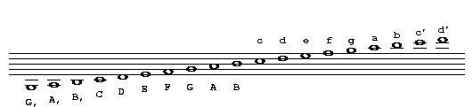]

and by extension other lower and higher notes are available.

Lower octaves are reached by using commas and higher octaves are written
using apostrophes; each extra comma/apostrophe lowers/raises the note by
an octave.

Programs should be able to to parse any combinations of `,` and `'`
signs appearing after the note. For example `C,',` (C comma apostrophe
comma) has the the same meaning as `C,` (C comma) and (uppercase) `C'`
(C apostrophe) should have the same meaning as (lowercase) `c`.

Alternatively, it is possible to raise or lower a section of
link:#music_code_definition[music code] using the `octave` parameter of
the `K:` or `V:` fields.

_Comment:_ The English note names `C`-`B`, which are used in the abc
system, correspond to the note names `do`-`si`, which are used in many
other languages: `do`=`C`, `re`=`D`, `mi`=`E`, `fa`=`F`, `sol`=`G`,
`la`=`A`, `si`=`B`.

[[accidentals]]
4.2 Accidentals
^^^^^^^^^^^^^^^

The symbols `^`, `=` and `_` are used (before a note) to notate
respectively a sharp, natural or flat. Double sharps and flats are
available with `^^` and `__` respectively.

[[note_lengths]]
4.3 Note lengths
^^^^^^^^^^^^^^^^

_Throughout this document note lengths are referred as sixteenth,
eighth, etc. The equivalents common in the U.K. are sixteenth note =
semi-quaver, eighth = quaver, quarter = crotchet and half = minim._

The link:#lunit_note_length[unit note length] for the transcription is
set in the `L:` field or, if the `L:` field does not exist, inferred
from the `M:` field. For example, `L:1/8` sets an eighth note as the
unit note length.

A single letter in the range `A-G`, `a-g` then represents a note of this
length. For example, if the unit note length is an eighth note, `DEF`
represents 3 eighth notes.

Notes of differing lengths can be obtained by simply putting a
multiplier after the letter. Thus if the unit note length is 1/16, `A`
or `A1` is a sixteenth note, `A2` an eighth note, `A3` a dotted eighth
note, `A4` a quarter note, `A6` a dotted quarter note, `A7` a double
dotted quarter note, `A8` a half note, `A12` a dotted half note, `A14` a
double dotted half note, `A15` a triple dotted half note and so on. If
the unit note length is `1/8`, `A` is an eighth note, `A2` a quarter
note, `A3` a dotted quarter note, `A4` a half note, and so on.

To get shorter notes, either divide them - e.g. if `A` is an eighth
note, `A/2` is a sixteenth note, `A3/2` is a dotted eighth note, `A/4`
is a thirty-second note - or change the link:#lunit_note_length[unit
note length] with the `L:` field. Alternatively, if the music has a
broken rhythm, e.g. dotted eighth note/sixteenth note pairs, use
link:#broken_rhythm[broken rhythm] markers.

Note that `A/` is shorthand for `A/2` and similarly `A//` = `A/4`, etc.

_Comment:_ Note lengths that can't be translated to conventional staff
notation are legal, but their representation by abc typesetting software
is undefined and they should be avoided.

_Note for developers:_ All compliant software should be able to handle
note lengths down to a 128th note; shorter lengths are optional.

[[broken_rhythm]]
4.4 Broken rhythm
^^^^^^^^^^^^^^^^^

A common occurrence in traditional music is the use of a dotted or
broken rhythm. For example, hornpipes, strathspeys and certain morris
jigs all have dotted eighth notes followed by sixteenth notes, as well
as vice-versa in the case of strathspeys. To support this, abc notation
uses a `>` to mean 'the previous note is dotted, the next note halved'
and `<` to mean 'the previous note is halved, the next dotted'.

_Example:_ The following lines all mean the same thing (the third
version is recommended):

[source,code]
----
L:1/16
a3b cd3 a2b2c2d2
----

[source,code]
----
L:1/8
a3/2b/2 c/2d3/2 abcd
----

[source,code]
----
L:1/8
a>b c<d abcd
----

/wiki/_detail/abc:standard:broken-80.png?id=abc%3Astandard%3Av2.1[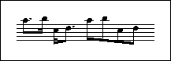]

As a logical extension, `>>` means that the first note is double dotted
and the second quartered and `>>>` means that the first note is triple
dotted and the length of the second divided by eight. Similarly for `<<`
and `<<<`.

Note that the use of broken rhythm markers between notes of unequal
lengths will produce undefined results, and should be avoided.

[[rests]]
4.5 Rests
^^^^^^^^^

Rests can be transcribed with a `z` or an `x` and can be modified in
length in exactly the same way as normal notes. `z` rests are printed in
the resulting sheet music, while `x` rests are invisible, that is, not
shown in the printed music.

Multi-measure rests are notated using `Z` (upper case) followed by the
number of measures.

_Example:_ The following excerpts, shown with the typeset results, are
musically equivalent (although they are typeset differently).

[source,code]
----
Z4|CD EF|GA Bc
----

/wiki/_detail/abc:standard:rests1-80.png?id=abc%3Astandard%3Av2.1[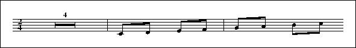]

[source,code]
----
z4|z4|z4|z4|CD EF|GA Bc
----

/wiki/_detail/abc:standard:rests2-80.png?id=abc%3Astandard%3Av2.1[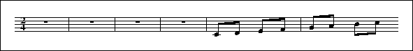]

When the number of measures is not given, `Z` is equivalent to a pause
of one measure.

By extension multi-measure invisible rests are notated using `X` (upper
case) followed by the number of measures and when the number of measures
is not given, `X` is equivalent to a pause of one measure.

_Comment:_ Although not particularly valuable, a multi-measure invisible
rest could be useful when a voice is silent for several measures.

[[clefs_and_transposition]]
4.6 Clefs and transposition
^^^^^^^^^^^^^^^^^^^^^^^^^^^

_VOLATILE:_ This section is subject to some clarifications with regard
to transposition, rules for the `middle` parameter and interactions
between different parameters.

Clef and transposition information may be provided in the `K:`
link:#kkey[key] and `V:` link:#multiple_voices[voice] fields. The
general syntax is:

[source,code]
----
[clef=]<clef name>[<line number>][+8 | -8] [middle=<pitch>] [transpose=<semitones>] [octave=<number>] [stafflines=<lines>]
----

(where `<…>` denotes a value, `[…]` denotes an optional parameter, and
`|` separates alternative values).

* `<clef name>` - may be `treble`, `alto`, `tenor`, `bass`, `perc` or
`none`. `perc` selects the drum clef. `clef=` may be omitted.
* `[<line number>]` - indicates on which staff line the base clef is
written. Defaults are: treble: `2`; alto: `3`; tenor: `4`; bass: `4`.
* `[+8 | -8]` - draws '8' above or below the staff. The player will
transpose the notes one octave higher or lower.
* `[middle=<pitch>]` - is an alternate way to define the line number of
the clef. The pitch indicates what note is displayed on the 3rd line of
the staff. Defaults are: treble: `B`; alto: `C`; tenor: `A,`; bass:
`D,`; none: `B`. This setting does not affect the playback.
* `[transpose=<semitones>]` - for playback, transpose the current voice
by the indicated amount of semitones; positive numbers transpose up,
negative down. This setting does not affect the printed score. The
default is 0.
* `[octave=<number>]` to raise (positive number) or lower (negative
number) the link:#music_code_definition[music code] in the current voice
by one or more octaves. This usage can help to avoid the need to write
lots of apostrophes or commas to raise or lower notes.
* `[stafflines=<lines>]` - the number of lines in the staff. The default
is 5.

Note that the `clef`, `middle`, `transpose`, `octave` and `stafflines`
specifiers may be used independent of each other.

_Examples:_

[source,code]
----
K:   clef=alto
K:   perc stafflines=1
K:Am transpose=-2
V:B  middle=d bass
----

Note that although this standard supports the drum clef, there is
currently no support for special percussion notes.

The middle specifier can be handy when working in the bass clef. Setting
`K:bass middle=d transpose=-24` will save you from adding comma
specifiers to the notes (the `transpose` setting is required to get the
playback sounding at the correct pitch). The specifier may be
abbreviated to `m=`.

The transpose specifier is useful, for example, for a Bb clarinet, for
which the music is written in the key of C although the instrument plays
it in the key of Bb:

[source,code]
----
V:Clarinet
K:C transpose=-2
----

The transpose specifier may be abbreviated to `t=`.

To notate the various standard clefs, one can use the following
specifiers:

The seven clefs

[cols=",",options="header",]
|=======================
|Name |specifier
|Treble |`K:treble`
|Bass |`K:bass`
|Baritone |`K:bass3`
|Tenor |`K:tenor`
|Alto |`K:alto`
|Mezzosoprano |`K:alto2`
|Soprano |`K:alto1`
|=======================

More clef names may be allowed in the future, therefore unknown names
should be ignored. If the clef is unknown or not specified, the default
is treble.

Applications may introduce their own clef line specifiers. These
specifiers should start with the name of the application, followed a
colon, followed by the name of the specifier.

_Example:_

[source,code]
----
V:p1 perc stafflines=3 m=C  mozart:noteC=snare-drum
----

[[beams]]
4.7 Beams
^^^^^^^^^

To group notes together under one beam they must be grouped together
without spaces. Thus in 2/4, `A2BC` will produce an eighth note followed
by two sixteenth notes under one beam whilst `A2 B C` will produce the
same notes separated. The beam slopes and the choice of upper or lower
stems are typeset automatically.

Notes that cannot be beamed may be placed next to each other. For
example, if `L:1/8` then `ABC2DE` is equivalent to `AB C2 DE`.

Back quotes `\`` may be used freely between notes to be beamed, to
increase legibility. They are ignored by computer programs. For example,
`A2\`\`B\`\`C` is equivalent to `A2BC`.

[[repeat_bar_symbols]]
4.8 Repeat/bar symbols
^^^^^^^^^^^^^^^^^^^^^^

Bar line symbols are notated as follows:

[cols=",",options="header",]
|==========================================
|*Symbol* |*Meaning*
|`|` |bar line
|`|]` |thin-thick double bar line
|`||` |thin-thin double bar line
|`[|` |thick-thin double bar line
|`|:` |start of repeated section
|`:|` |end of repeated section
|`::` |start & end of two repeated sections
|==========================================

_Recommendation for developers:_ If an 'end of repeated section' is
found without a previous 'start of repeated section', playback programs
should restart the music from the beginning of the tune, or from the
latest double bar line or end of repeated section.

Note that the notation `::` is short for `:|` followed by `|:`. The
variants `::`, `:|:` and `:||:` are all equivalent.

By extension, `|::` and `::|` mean the start and end of a section that
is to be repeated three times, and so on.

A dotted bar line can be notated by preceding it with a dot, e.g. `.|` -
this may be useful for notating editorial bar lines in music with very
long measures.

An invisible bar line may be notated by putting the bar line in
brackets, e.g. `[|]` - this may be useful for notating
link:#voice_overlay[voice overlay] in meter-free music.

Abc parsers should be quite liberal in recognizing bar lines. In the
wild, bar lines may have any shape, using a sequence of `|` (thin bar
line), `[` or `]` (thick bar line), and `:` (dots), e.g. `|[|` or
`[|:::` .

[[first_and_second_repeats]]
4.9 First and second repeats
^^^^^^^^^^^^^^^^^^^^^^^^^^^^

First and second repeats can be notated with the symbols `[1` and `[2`,
e.g.

[source,code]
----
faf gfe|[1 dfe dBA:|[2 d2e dcB|].
----

When adjacent to bar lines, these can be shortened to ` |1` and `:|2`,
but with regard to spaces

[source,code]
----
| [1
----

is legal, while

[source,code]
----
| 1
----

is not.

Thus, a tune with different ending for the first and second repeats has
the general form:

[source,code]
----
|:  <common body of tune>  |1  <first ending>  :|2  <second ending>  |]
----

Note that in many link:#abc_file_definition[abc files] the `|:` may not
be present.

[[variant_endings]]
4.10 Variant endings
^^^^^^^^^^^^^^^^^^^^

In combination with `P:` link:#pparts[part notation], it is possible to
notate more than two variant endings for a section that is to be
repeated a number of times.

For example, if the header of the tune contains `P:A4.B4` then parts A
and B will each be played 4 times. To play a different ending each time,
you could write in the tune:

[source,code]
----
P:A
<notes> | [1  <notes>  :| [2 <notes> :| [3 <notes> :| [4 <notes> |]
----

The Nth ending starts with `[N` and ends with one of `||`, `:|` `|]` or
`[|`. You can also mark a section as being used for more than one ending
e.g.

[source,code]
----
[1,3 <notes> :|
----

plays on the 1st and 3rd endings and

[source,code]
----
[1-3 <notes> :|
----

plays on endings 1, 2 and 3. In general, '[' can be followed by any list
of numbers and ranges as long as it contains no spaces e.g.

[source,code]
----
[1,3,5-7  <notes>  :| [2,4,8 <notes> :|
----

[[ties_and_slurs]]
4.11 Ties and slurs
^^^^^^^^^^^^^^^^^^^

You can tie two notes of the same pitch together, within or between
bars, with a `-` symbol, e.g. `abc-|cba` or `c4-c4`. The tie symbol must
always be adjacent to the first note of the pair, but does not need to
be adjacent to the second, e.g. `c4 -c4` and `abc|-cba` are not legal -
see link:#order_of_abc_constructs[order of abc constructs].

More general slurs can be put in with `()` symbols. Thus `(DEFG)` puts a
slur over the four notes. Spaces within a slur are OK, e.g.
` ( D E F G ) `.

Slurs may be nested:

[source,code]
----
(c (d e f) g a)
----

/wiki/_detail/abc:standard:slur1-80.png?id=abc%3Astandard%3Av2.1[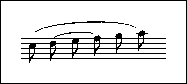]

and they may also start and end on the same note:

[source,code]
----
(c d (e) f g a)
----

/wiki/_detail/abc:standard:slur2-80.png?id=abc%3Astandard%3Av2.1[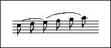]

A dotted slur may be notated by preceding the opening brace with a dot,
e.g. `.(cde)`; it is optional to place a dot immediately before the
closing brace. Likewise, a dotted tie can be transcribed by preceding it
with a dot, e.g. `C.-C`. This is especially useful in parts with
multiple verses: some verses may require a slur, some may not.

It should be noted that although the tie `-` and slur `()` produce
similar symbols in staff notation they have completely different
meanings to player programs and should not be interchanged. Ties connect
two successive notes __of the same pitch__, causing them to be played as
a single note, while slurs connect the first and last note of any series
of notes, and may be used to indicate phrasing, or that the group should
be played legato. Both ties and slurs may be used into, out of and
between chords, and in this case the distinction between them is
particularly important.

[[grace_notes]]
4.12 Grace notes
^^^^^^^^^^^^^^^^

Grace notes can be written by enclosing them in curly braces, `{}`. For
example, a taorluath on the Highland pipes would be written `{GdGe}`.
The tune 'Athol Brose' (in the file link:#strspysabc[Strspys.abc]) has
an example of complex Highland pipe gracing in all its glory. Although
nominally grace notes have no melodic time value, expressions such as
`{a3/2b/}` or `{a>b}` can be useful and are legal although some software
may ignore them. The unit duration to use for gracenotes is not
specified by the link:#abc_file_definition[abc file], but by the
software, and might be a specific amount of time (for playback purposes)
or a note length (e.g. 1/32 for Highland pipe music, which would allow
`{ge4d}` to code a piobaireachd 'cadence').

To distinguish between appoggiaturas and acciaccaturas, the latter are
notated with a forward slash immediately following the open brace, e.g.
`{/g}C` or `{/gagab}C`:

/wiki/_detail/abc:standard:graces-80.png?id=abc%3Astandard%3Av2.1[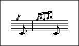]

The presence of gracenotes is transparent to the broken rhythm
construct. Thus the forms `A<{g}A` and `A{g}<A` are legal and equivalent
to `A/2{g}A3/2`.

[[duplets_triplets_quadruplets_etc]]
4.13 Duplets, triplets, quadruplets, etc.
^^^^^^^^^^^^^^^^^^^^^^^^^^^^^^^^^^^^^^^^^

These can be simply coded with the notation `(2ab` for a duplet, `(3abc`
for a triplet or `(4abcd` for a quadruplet, etc, up to `(9`. The musical
meanings are:

[cols=",",options="header",]
|================================
|*Symbol* |*Meaning*
|`(2` |2 notes in the time of 3
|`(3` |3 notes in the time of 2
|`(4` |4 notes in the time of 3
|`(5` |5 notes in the time of _n_
|`(6` |6 notes in the time of 2
|`(7` |7 notes in the time of _n_
|`(8` |8 notes in the time of 3
|`(9` |9 notes in the time of _n_
|================================

If the time signature is compound (6/8, 9/8, 12/8) then _n_ is three,
otherwise _n_ is two.

More general tuplets can be specified using the syntax `(p:q:r` which
means 'put _p_ notes into the time of _q_ for the next _r_ notes'. If
_q_ is not given, it defaults as above. If _r_ is not given, it defaults
to __p__.

For example, `(3` is equivalent to `(3::` or `(3:2` , which in turn are
equivalent to `(3:2:3`, whereas `(3::2` is equivalent to `(3:2:2`.

This can be useful to include notes of different lengths within a
tuplet, for example `(3:2:2 G4c2` or `(3:2:4 G2A2Bc`. It also describes
more precisely how the simple syntax works in cases like `(3 D2E2F2` or
even `(3 D3EF2`. The number written over the tuplet is __p__.

Spaces that appear between the tuplet specifier and the following notes
are to be ignored.

[[decorations]]
4.14 Decorations
^^^^^^^^^^^^^^^^

A number of shorthand decoration symbols are available:

[source,code]
----
.       staccato mark
~       Irish roll
H       fermata
L       accent or emphasis
M       lowermordent
O       coda
P       uppermordent
S       segno
T       trill
u       up-bow
v       down-bow
----

Decorations should be placed before the note which they decorate - see
link:#order_of_abc_constructs[order of abc constructs]

_Examples:_

[source,code]
----
(3.a.b.c    % staccato triplet
vAuBvA      % bowing marks (for fiddlers)
----

Most of the characters above (`~HLMOPSTuv`) are just short-cuts for
commonly used decorations and can even be redefined (see
link:#redefinable_symbols[redefinable symbols]).

More generally, symbols can be entered using the syntax `!symbol!`, e.g.
`!trill!A4` for a trill symbol. (Note that the abc standard version 2.0
used instead the syntax `+symbol+` - this dialect of abc is still
available, but is now link:#outdated_syntax[deprecated] - see
link:#decoration_dialects[decoration dialects].)

The currently defined symbols are:

[source,code]
----
!trill!                "tr" (trill mark)
!trill(!               start of an extended trill
!trill)!               end of an extended trill
!lowermordent!         short /|/|/ squiggle with a vertical line through it
!uppermordent!         short /|/|/ squiggle
!mordent!              same as !lowermordent!
!pralltriller!         same as !uppermordent!
!roll!                 a roll mark (arc) as used in Irish music
!turn!                 a turn mark (also known as gruppetto)
!turnx!                a turn mark with a line through it
!invertedturn!         an inverted turn mark
!invertedturnx!        an inverted turn mark with a line through it
!arpeggio!             vertical squiggle
!>!                    > mark
!accent!               same as !>!
!emphasis!             same as !>!
!fermata!              fermata or hold (arc above dot)
!invertedfermata!      upside down fermata
!tenuto!               horizontal line to indicate holding note for full duration
!0! - !5!              fingerings
!+!                    left-hand pizzicato, or rasp for French horns
!plus!                 same as !+!
!snap!                 snap-pizzicato mark, visually similar to !thumb!
!slide!                slide up to a note, visually similar to a half slur
!wedge!                small filled-in wedge mark
!upbow!                V mark
!downbow!              squared n mark
!open!                 small circle above note indicating open string or harmonic
!thumb!                cello thumb symbol
!breath!               a breath mark (apostrophe-like) after note
!pppp! !ppp! !pp! !p!  dynamics marks
!mp! !mf! !f! !ff!     more dynamics marks
!fff! !ffff! !sfz!     more dynamics marks
!crescendo(!           start of a < crescendo mark
!<(!                   same as !crescendo(!
!crescendo)!           end of a < crescendo mark, placed after the last note
!<)!                   same as !crescendo)!
!diminuendo(!          start of a > diminuendo mark
!>(!                   same as !diminuendo(!
!diminuendo)!          end of a > diminuendo mark, placed after the last note
!>)!                   same as !diminuendo)!
!segno!                2 ornate s-like symbols separated by a diagonal line
!coda!                 a ring with a cross in it
!D.S.!                 the letters D.S. (=Da Segno)
!D.C.!                 the letters D.C. (=either Da Coda or Da Capo)
!dacoda!               the word "Da" followed by a Coda sign
!dacapo!               the words "Da Capo"
!fine!                 the word "fine"
!shortphrase!          vertical line on the upper part of the staff
!mediumphrase!         same, but extending down to the centre line
!longphrase!           same, but extending 3/4 of the way down
----

Here is a picture of most decorations:

/wiki/_detail/abc:standard:decorations.0000.png?id=abc%3Astandard%3Av2.1[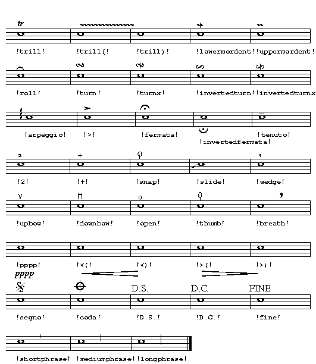]

Note that the decorations may be applied to notes, rests, note groups,
and bar lines. If a decoration is to be typeset between notes, it may be
attached to the `y` spacer - see
link:#typesetting_extra_space[typesetting extra space].

Spaces may be used freely between each of the symbols and the object to
which it should be attached. Also an object may be preceded by multiple
symbols, which should be printed one over another, each on a different
line.

_Example:_

[source,code]
----
[!1!C!3!E!5!G]  !coda! y  !p! !trill! C   !fermata!|
----

/wiki/_detail/abc:standard:decorations2-80.png?id=abc%3Astandard%3Av2.1[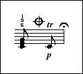]

Player programs may choose to ignore most of the symbols mentioned
above, though they may be expected to implement the dynamics marks, the
accent mark and the staccato dot. Default volume is equivalent to !mf!.
On a scale from 0-127, the relative volumes can be roughly defined as:
`!pppp!` = `!ppp!` = 30, `!pp!` = 45, `!p!` = 60, `!mp!` = 75, `!mf!` =
90, `!f!` = 105, `!ff!` = 120, `!fff!` = `!ffff!` = 127.

Abc software may also allow users to define new symbols in a package
dependent way.

Note that symbol names may not contain any spaces, `[`, `]`, `|` or `:`
signs, e.g. while !dacapo! is legal, !da capo! is not.

If an unimplemented or unknown symbol is found, it should be ignored.

_Recommendation:_ A good source of general information about decorations
can be found at http://www.dolmetsch.com/musicalsymbols.htm.

[[symbol_lines]]
4.15 Symbol lines
^^^^^^^^^^^^^^^^^

Adding many symbols to a line of music can make a tune difficult to
read. In such cases, a symbol line (a line that contains only `!…!`
link:#decorations[decorations], `"…"` link:#chord_symbols[chord symbols]
or link:#annotations[annotations]) can be used, analogous to a line of
link:#lyrics[lyrics].

A symbol line starts with `s:`, followed by a line of symbols. Matching
of notes and symbols follow the link:#alignment[alignment rules] defined
for lyrics (meaning that symbols in an `s:` line cannot be aligned on
link:#grace_notes[grace notes], link:#rests[rests] or
link:#typesetting_extra_space[spacers]).

_Example:_

[source,code]
----
   CDEF    | G```AB`c
s: "^slow" | !f! ** !fff!
----

It is also possible to stack `s:` lines to produced multiple symbols on
a note.

_Example:_ The following two excerpts are equivalent and would place a
decorations plus a chord on the `E`.

[source,code]
----
   C2  C2 Ez   A2|
s: "C" *  "Am" * |
s: *   *  !>!  * |
----

[source,code]
----
"C" C2 C2 "Am" !>! Ez A2|
----

[[redefinable_symbols]]
4.16 Redefinable symbols
^^^^^^^^^^^^^^^^^^^^^^^^

As a short cut to writing symbols which avoids the `!symbol!` syntax
(see link:#decorations[decorations]), the letters `H-W` and `h-w` and
the symbol `~` can be assigned with the `U:` field. For example, to
assign the letter `T` to represent the trill, you can write:

[source,code]
----
U: T = !trill!
----

You can also use `"^text"`, etc (see link:#annotations[annotations]
below) in definitions

_Example:_ To print a plus sign over notes, define `p` as follows and
use it before the required notes:

[source,code]
----
U: p = "^+"
----

Symbol definitions can be written in the
link:#file_header_definition[file header], in which case they apply to
all the tunes in that file, or in a link:#tune_header_definition[tune
header], when they apply only to that tune, and override any previous
definitions. Programs may also make use of a set of global default
definitions, which apply everywhere unless overridden by local
definitions. You can assign the same symbol to two or more letters e.g.

[source,code]
----
U: T = !trill!
U: U = !trill!
----

in which case the same visible symbol will be produced by both letters
(but they may be played differently), and you can de-assign a symbol by
writing:

[source,code]
----
U: T = !nil!
----

or

[source,code]
----
U: T = !none!
----

The standard set of definitions (if you do not redefine them) is:

[source,code]
----
U: ~ = !roll!
U: H = !fermata!
U: L = !accent!
U: M = !lowermordent!
U: O = !coda!
U: P = !uppermordent!
U: S = !segno!
U: T = !trill!
U: u = !upbow!
U: v = !downbow!
----

Please see link:#macros[macros] for an advanced macro mechanism.

[[chords_and_unisons]]
4.17 Chords and unisons
^^^^^^^^^^^^^^^^^^^^^^^

Chords (i.e. more than one note head on a single stem) can be coded with
`[]` symbols around the notes, e.g.

[source,code]
----
[CEGc]
----

indicates the chord of C major. They can be grouped in beams, e.g.

[source,code]
----
[d2f2][ce][df]
----

but there should be no spaces within the notation for a chord. See the
tune 'Kitchen Girl' in the sample file link:#reelsabc[Reels.abc] for a
simple example.

All the notes within a chord should normally have the same length, but
if not, the chord duration is that of the first note.

_Recommendation:_ Although playback programs should not have any
difficulty with notes of different lengths, typesetting programs may not
always be able to render the resulting chord to staff notation (for
example, an eighth and a quarter note cannot be represented on the same
stem) and the result is undefined. Consequently, this is not
recommended.

More complicated chords can be transcribed with the `&` operator (see
link:#voice_overlay[voice overlay]).

The chord forms a syntactic grouping, to which the same prefixes and
postfixes can be attached as to an ordinary note (except for accidentals
which should be attached to individual notes within the chord and
decorations which may be attached to individual notes within the chord
or may be attached to the chord as a whole).

_Example:_

[source,code]
----
( "^I" !f! [CEG]- > [CEG] "^IV" [F=AC]3/2"^V"[GBD]/  H[CEG]2 )
----

/wiki/_detail/abc:standard:chords-80.png?id=abc%3Astandard%3Av2.1[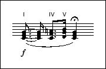]

When both inside and outside the chord length modifiers are used, they
should be multiplied. _Example:_ `[C2E2G2]3` has the same meaning as
`[CEG]6`.

If the chord contains two notes of the same pitch, then it is a unison
(e.g. a note played on two strings of a violin simultaneously) and is
shown with one stem and two note-heads.

_Example:_

[source,code]
----
[DD]
----

/wiki/_detail/abc:standard:unison-80.png?id=abc%3Astandard%3Av2.1[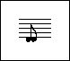]

[[chord_symbols]]
4.18 Chord symbols
^^^^^^^^^^^^^^^^^^

_VOLATILE:_ The list of chords and how they are handled will be extended
at some point. Until then programs should treat chord symbols quite
liberally.

Chord symbols (e.g. chords/bass notes) can be put in under the melody
line (or above, depending on the package) using double-quotation marks
placed to the left of the note it is sounded with, e.g. `"Am7"A2D2`.

The chord has the format __<note><accidental><type></bass>__, where
_<note>_ can be `A-G`, the optional _<accidental>_ can be `b`, `#`, the
optional _<type>_ is one or more of

[source,code]
----
m or min        minor
maj             major
dim             diminished
aug or +        augmented
sus             suspended
7, 9 ...        7th, 9th, etc.
----

and _</bass>_ is an optional bass note.

A slash after the chord type is used only if the optional bass note is
also used, e.g., `"C/E"`. If the bass note is a regular part of the
chord, it indicates the inversion, i.e., which note of the chord is
lowest in pitch. If the bass note is not a regular part of the chord, it
indicates an additional note that should be sounded with the chord,
below it in pitch. The bass note can be any letter (`A-G` or `a-g`),
with or without a trailing accidental sign (`b` or `#`). The case of the
letter used for the bass note does not affect the pitch.

Alternate chords can be indicated for printing purposes (but not for
playback) by enclosing them in parentheses inside the double-quotation
marks after the regular chord, e.g., `"G(Em)"`.

_Note to developers:_ Software should also be able to recognise and
handle appropriately the unicode versions of flat, natural and sharp
symbols (♭, ♮, ♯) - see link:#special_symbols[special symbols].

[[annotations]]
4.19 Annotations
^^^^^^^^^^^^^^^^

General text annotations can be added above, below or on the staff in a
similar way to chord symbols. In this case, the string within double
quotes is preceded by one of five symbols `^`, `_`, `<`, `>` or `@`
which controls where the annotation is to be placed; above, below, to
the left or right respectively of the following note, rest or bar line.
Using the `@` symbol leaves the exact placing of the string to the
discretion of the interpreting program. These placement specifiers
distinguish annotations from chord symbols, and should prevent programs
from attempting to play or transpose them. All text that follows the
placement specifier is treated as a link:#text_string_definition[text
string].

Where two or more annotations with the same placement specifier are
placed consecutively, e.g. for fingerings, the notation program should
draw them on separate lines, with the first listed at the top.

_Example:_ The following annotations place the note between parentheses.

[source,code]
----
"<(" ">)" C
----

[[order_of_abc_constructs]]
4.20 Order of abc constructs
^^^^^^^^^^^^^^^^^^^^^^^^^^^^

The order of abc constructs for a note is: __<grace notes>__, __<chord
symbols>__, _<annotations>/<decorations>_ (e.g. Irish roll, staccato
marker or up/downbow), __<accidentals>__, __<note>__, __<octave>__,
__<note length>__, i.e. `~^c'3` or even `"Gm7"v.=G,2`.

Each link:#ties_and_slurs[tie symbol], `-`, should come immediately
after a note group but may be followed by a space, i.e. `=G,2- `. Open
and close chord delimiters, `[` and `]`, should enclose entire note
sequences (except for chord symbols), e.g.

[source,code]
----
"C"[CEGc]|
|"Gm7"[.=G,^c']
----

and open and close slur symbols, `()`, should do likewise, i.e.

[source,code]
----
"Gm7"(v.=G,2~^c'2)
----

'''''

[[lyrics]]
5. Lyrics
~~~~~~~~~

The `W:` link:#information_field_definition[information field]
(uppercase W) can be used for lyrics to be printed separately below the
tune.

The `w:` link:#information_field_definition[information field]
(lowercase w) in the link:#tune_body_definition[tune body], supplies
lyrics to be aligned syllable by syllable with previous notes of the
current voice.

[[alignment]]
5.1 Alignment
^^^^^^^^^^^^^

When adjacent, `w:` fields indicate different verses (link:#verses[see
below]), but for non-adjacent `w:` fields, the alignment of the lyrics:

* starts at the first note of the voice if there is no previous `w:`
field; or
* starts at the first note after the notes aligned to the previous `w:`
field; and
* associates syllables to notes up to the end of the `w:` line.

_Example:_ The following two examples are equivalent.

[source,code]
----
C D E F|
w: doh re mi fa
G A B c|
w: sol la ti doh
----

[source,code]
----
C D E F|
G A B c|
w: doh re mi fa sol la ti doh
----

_Comment:_ The second example, made possible by an extension (introduced
in abc 2.1) of the alignment rules, means that lyrics no longer have to
follow immediately after the line of notes to which they are attached.
Indeed, the placement of the lyrics can be postponed to the end of the
link:#tune_body_definition[tune body]. However, the extension of the
alignment rules is not fully backwards compatible with abc 2.0 - see
link:#outdated_lyrics_alignment[outdated lyrics alignment] for an
explanation.

If there are fewer syllables than available notes, the remaining notes
have no lyric (blank syllables); thus the appearance of a `w:` field
associates all the notes that have appeared previously with a syllable
(either real or blank).

_Example:_ In the following example the empty `w:` field means that the
4 `G` notes have no lyric associated with them.

[source,code]
----
C D E F|
w: doh re mi fa
G G G G|
w:
F E F C|
w: fa mi re doh
----

If there are more syllables than available notes, any excess syllables
will be ignored.

_Recommendation for developers:_ If a `w:` line does not contain the
correct number of syllables for the corresponding notes, the program
should warn the user. However, having insufficient syllables is
legitimate usage (as above) and so the program may allow these warnings
to be switched off.

Note that syllables are not aligned on link:#grace_notes[grace notes],
link:#rests[rests] or link:#typesetting_extra_space[spacers] and that
tied, slurred or beamed notes are treated as separate notes in this
context.

The lyrics lines are treated as link:#text_string_definition[text
strings]. Within the lyrics, the words should be separated by one or
more spaces and to correctly align them the following symbols may be
used:

[cols=",",options="header",]
|===================================================================
|*Symbol* |*Meaning*
|`-` |(hyphen) break between syllables within a word
|`_` |(underscore) previous syllable is to be held for an extra note
|`*` |one note is skipped (i.e. * is equivalent to a blank syllable)
|`~` |appears as a space; aligns multiple words under one note
|`\-` |appears as hyphen; aligns multiple syllables under one note
|`|` |advances to the next bar
|===================================================================

Note that if `-` is preceded by a space or another hyphen, the `-` is
regarded as a separate syllable.

When an underscore is used next to a hyphen, the hyphen must always come
first.

If there are not as many syllables as notes in a measure, typing a `|`
automatically advances to the next bar; if there are enough syllables
the `|` is just ignored.

_Examples:_

[source,code]
----
w: syll-a-ble    is aligned with three notes
w: syll-a--ble   is aligned with four notes
w: syll-a -ble   (equivalent to the previous line)
w: time__        is aligned with three notes
w: of~the~day    is treated as one syllable (i.e. aligned with one note)
                 but appears as three separate words
----

[source,code]
----
 gf|e2dc B2A2|B2G2 E2D2|.G2.G2 GABc|d4 B2
w: Sa-ys my au-l' wan to your aul' wan,
+: Will~ye come to the Wa-x-ies dar-gle?
----

See link:#field_continuation[field continuation] for the meaning of the
`+:` field continuation.

[[verses]]
5.2 Verses
^^^^^^^^^^

It is possible for a music line to be followed by several adjacent `w:`
fields, i.e. immediately after each other. This can be used, together
with part notation, to represent different verses. The first `w:` field
is used the first time that part is played, then the second and so on.

_Examples:_ The following two examples are equivalent and contain two
verses:

[source,code]
----
CDEF FEDC|
w: these are the lyr-ics for verse one
w: these are the lyr-ics for verse two
----

[source,code]
----
CDEF FEDC|
w: these are the lyr-ics
+:  for verse one
w: these are the lyr-ics
+:  for verse two  
----

[[numbering]]
5.3 Numbering
^^^^^^^^^^^^^

_VOLATILE:_ The following syntax may be extended to include non-numeric
"numbering".

If the first word of a `w:` line starts with a digit, this is
interpreted as numbering of a stanza. Typesetting programs should align
the corresponding note with the first letter that occurs. This can be
used in conjunction with the `~` symbol mentioned in the table above to
create a space between the digit and the first letter.

_Example:_ In the following, the `1.~Three` is treated as a single word
with a space created by the `~`, but the fact that the `w:` line starts
with a number means that the first note of the corresponding music line
is aligned to `Three`.

[source,code]
----
   w: 1.~Three blind mice
----

'''''

[[typesetting_and_playback]]
6. Typesetting and playback
~~~~~~~~~~~~~~~~~~~~~~~~~~~

[[typesetting]]
6.1 Typesetting
^^^^^^^^^^^^^^^

[[typesetting_line-breaks]]
6.1.1 Typesetting line-breaks
+++++++++++++++++++++++++++++

_Terminology:_ *Line-breaks* in a document (also known in computing as
new lines, line-feeds, carriage-returns, end-of-lines, etc.) determine
how the document is set out on the page. Throughout this section, and
elsewhere in the standard, a distinction should be noted between

* a **code line-break**, meaning a line-break in the abc
link:#tune_body_definition[tune body], and, in particular, at the end of
a line of link:#music_code_definition[music code];
* a **score line-break**, meaning a line-break in the printed
score.

The fundamental mechanism for typesetting
link:#score_line-break_definition[score line-breaks] is by using
link:#code_line-break_definition[code line-breaks] - one line of
link:#music_code_definition[music code] in the
link:#tune_body_definition[tune body] normally corresponds to one line
of printed music.

Of course the printed representation of a line of
link:#music_code_definition[music code] may be too long for the staff,
so if necessary, typesetting programs should introduce additional
link:#score_line-break_definition[score line-breaks]. As a consequence,
if you would prefer link:#score_line-break_definition[score line-breaks]
to be handled completely automatically (as is common in non-abc scoring
software), then just type the link:#tune_body_definition[tune body] on a
single line of link:#music_code_definition[music code].

Even though most abc GUI software should wrap over-long lines, typing
the link:#tune_body_definition[tune body] on a single line may not
always be convenient, particularly for users who wish to include
link:#code_line-break_definition[code line-breaks] to aid readability or
if the abc code is to be emailed (see
link:#continuation_of_input_lines[continuation of input lines]).

Furthermore, in the past some typesetting programs used `!` characters
in the abc code to force link:#score_line-break_definition[score
line-breaks].

As a result, abc 2.1 introduces a new line-breaking instruction.

[[ilinebreak]]
I:linebreak

To allow for all line-breaking preferences, the `I:linebreak`
instruction may be used, together with four possible values, to control
link:#score_line-break_definition[score line-breaking].

* "`I:linebreak $`" indicates that the `$` symbol is used in the
link:#tune_body_definition[tune body] to typeset a
link:#score_line-break_definition[score line-break]. Any
link:#code_line-break_definition[code line-breaks] are ignored for
typesetting purposes.

_Example:_ The following abc code should be typeset on two lines.

[source,code]
----
I:linebreak $
K:G
|:abc def|$fed cba:|
----

* "`I:linebreak !`" indicates that the `!` symbol is used to typeset a
link:#score_line-break_definition[score line-break]. Any
link:#code_line-break_definition[code line-breaks] are ignored for
typesetting purposes.

_Comment:_ The "`I:linebreak !`" instruction works in the same way as
`I:linebreak $` and is primarily provided for backwards compatibility -
see link:#line-breaking_dialects[line-breaking dialects], so that
"`I:linebreak $`" is the preferred usage. "`I:linebreak !`" also
automatically invokes the "`I:decoration +`" instruction - see
link:#decoration_dialects[decoration dialects]. Finally,
"`I:linebreak !`" is equivalent to the link:#outdated_syntax[deprecated]
directive `%%continueall true` - see link:#outdated_directives[outdated
directives].

* "`I:linebreak <EOL>`" indicates that the End Of Line character (CR, LF
or CRLF) is used to typeset a link:#score_line-break_definition[score
line-break]. In other words, link:#code_line-break_definition[code
line-breaks] are used for typesetting
link:#score_line-break_definition[score line-breaks].

* "`I:linebreak <none>`" indicates that all line-breaking is to be
carried out automatically and any link:#code_line-break_definition[code
line-breaks] are ignored for typesetting purposes.

The values `<EOL>`, `$` and `!` may also be combined so that more that
one symbol can indicate a link:#score_line-break_definition[score
line-break].

The default line-break setting is:

[source,code]
----
I:linebreak <EOL> $
----

meaning that both link:#code_line-break_definition[code line-breaks],
and `$` symbols, generate a link:#score_line-break_definition[score
line-break].

_Comment:_ Although "`I:linebreak $ !`" is legal it is not recommended
as it uses two different symbols to mean the same thing.

An `I:linebreak` instruction can be used either in the
link:#file_header_definition[file header] (in which case it is applied
to every link:#abc_tune_definition[tune] in the
link:#abc_file_definition[abc file]), or in a
link:#tune_header_definition[tune header] (in which case it is applied
to that tune only and overrides a line-breaking instruction in the
link:#file_header_definition[file header]). Similarly, if two
`I:linebreak` instructions appear in a link:#file_header_definition[file
header] or a link:#tune_header_definition[tune header], the second
cancels the first.

_Comment:_ It can be sometimes be useful to include two instructions
together - for example, "`I:linebreak <EOL> $`" and
"`I:linebreak <none>`" can be used to toggle between default and
automatic line-breaking simply by swapping the position of the two
lines.

`I:linebreak` instructions are not allowed in the
link:#tune_body_definition[tune body] (principally because it conflicts
with the human readability of the link:#music_code_definition[music
code]).

[[suppressing_score_line-breaks]]
Suppressing score line-breaks

When the `<EOL>` character is being used in the
link:#tune_body_definition[tune body] to indicate
link:#score_line-break_definition[score line-breaks], it sometimes
useful to be able to tell typesetting software to ignore a particular
link:#code_line-break_definition[code line-breaks]. This is achieved
using a backslash (`\`) at the end of a line of
link:#music_code_definition[music code]. The backslash may be followed
by trailing whitespace and/or link:#comment_definition[comments], since
they are removed before the line is processed.

_Example:_ The following two excerpts are considered equivalent and
should be typeset as a single staff in the printed score.

[source,code]
----
abc cba|\ % end of line comment
abc cba|

abc cba|abc cba|
----

The backslash effectively joins two lines together for processing so if
space is required between the two half lines (for example, to prevent
the notes from being beamed together), it can be placed before the
backslash, or at the beginning of the next half line.

_Example:_ The following three excerpts are considered equivalent.

[source,code]
----
abc \
cba|

abc\
 cba|

abc cba|  
----

There is no limit to the number of lines that may be joined together in
this way. However, a backslash must not be used before an
link:#empty_line_definition[empty line].

_Example:_ The following is legal.

[source,code]
----
cdef|\
\
cedf:|
----

_Example:_ The following is not legal.

[source,code]
----
cdef|\

cdef:|
----

In the examples above, where a line of link:#music_code_definition[music
code] follows immediately after a line ending in backslash, the
backslash acts as a continuation for two lines of
link:#music_code_definition[music code] and can therefore be used to
split up long link:#music_code_definition[music code] lines.

More importantly, however, any
link:#information_field_definition[information fields] and
link:#stylesheet_directive_definition[stylesheet directives] are
processed (and link:#comment_definition[comments] are removed) at the
point where the physical line-break occurs. Hence the backslash is
commonly used to include meter or key changes halfway through a line of
music.

_Example:_ The following should be typeset as a single staff in the
printed score.

[source,code]
----
abc cab|\
%%setbarnb 10
M:9/8
%comment
abc cba abc|
----

_Alternative usage example:_ The above could also be achieved using
link:#inline_field_definition[inline fields], the `I:<directive>` form
instead of `%%<directive>` and a `r:remark` in place of the
link:#comment_definition[comment], i.e.

[source,code]
----
abc cab|[I:setbarnb 10][M:9/8][r:comment]abc cba abc|
----

Finally, note that if the the `<EOL>` character is not being used to
indicate link:#score_line-break_definition[score line-breaks], then the
backslash is effectively redundant.

_Recommendation to users:_ If you find that you are using backslash
symbols on most lines of link:#music_code_definition[music code], then
consider instead using "`I:linebreak <none>`" or "`I:linebreak $`" which
will mean that all the link:#code_line-break_definition[code
line-breaks] will be ignored for the purposes of generating
link:#score_line-break_definition[score line-breaks] (and, in the latter
case, you can encode a link:#score_line-break_definition[score
line-breaks] with the `$` character).

[[typesetting_extra_space]]
6.1.2 Typesetting extra space
+++++++++++++++++++++++++++++

`y` can be used to add extra space between the surrounding notes;
moreover, link:#chord_symbols[chord symbols] and
link:#decorations[decorations] can be attached to it, to separate them
from notes.

_Example:_

[source,code]
----
"Am" !pp! y
----

Note that the `y` symbol does _not_ create link:#rests[rests] in the
music.

[[typesetting_information_fields]]
6.1.3 Typesetting information fields
++++++++++++++++++++++++++++++++++++

By default typesetting programs should include the the title (T),
composer (C), origin (O), parts (P), tempo (Q), aligned words (w) and
other words (W) in the printed score, using the follow scheme:

* the `T:title` should be printed centred above the tune; alternative
titles should be printed underneath the main title in smaller print
* the `C:composer` should be printed right-aligned, just below the
title, each composer on a separate line
* the contents of the `O:origin` field should be appended to the
`C:composer` field, surrounded by parentheses
* each `P:part` in the link:#tune_body_definition[tune body] should have
the string identifying it printed immediately above the start of that
part; if there is a `P:parts` field in the
link:#tune_header_definition[tune header] (describing which order the
parts are played in) it should be printed left-aligned above the start
of the tune
* the `Q:tempo` should be printed above the tune at the start of the
section to which it applies
* the aligned `w:words` (lyrics) should be printed under each line of
music with other `W:words` printed beneath the tune - see
link:#lyrics[lyrics]

To suppress any of these, or alternatively to typeset additional
link:#information_field_definition[information fields] such as notes
(N), history (H), rhythm (R), book (B), discography (D), file (F),
source (S) or transcription (Z), use the `%%writefields` directive - see
link:#information_directives[information directives].

To customise the typesetting (for example, by changing the font), see
link:#formatting_directives[formatting directives].

[[playback]]
6.2 Playback
^^^^^^^^^^^^

Many of the link:#information_field_definition[information fields] are
ignored by playback programs - exceptions are `I:`, `K:`, `L:`, `M:`,
`m:`, `P;`, `Q:`, `s:`, `U:` and `V:`.

In addition, playback programs that store their output in file types
which have provisions for metadata (e.g. MIDI, ogg, mp3), may record the
contents the `T:`, `C:`, `w:` and `W:` fields in that metadata.

Furthermore, playback programs may use the `R:` field to infer stress
patterns in a tune (i.e. to make playback closer to real music, by for
example, placing more stress on the first note in each bar); however,
such usage is not standardised.

Most playback customisation is handled by
link:#instrumentation_directives[instrumentation directives].

'''''

[[multiple_voices]]
7. Multiple voices
~~~~~~~~~~~~~~~~~~

_VOLATILE:_ Multi-voice music is under active review, with discussion
about control voices and interaction between `P:`, `V:` and `T:` fields.
It is intended that the syntax will be finalised in abc 2.2.

The `V:` field allows the writing of multi-voice music. In multi-voice
link:#abc_tune_definition[abc tunes], the
link:#tune_body_definition[tune body] is divided into several voices,
each beginning with a `V:` field. All the notes following such a `V:`
field, up to the next `V:` field or the end of the
link:#tune_body_definition[tune body], belong to the voice.

The basic syntax of the field is:

[source,code]
----
V:ID
----

where ID can be either a number or a string, that uniquely identifies
the voice in question. When using a string, only the first 20 characters
of it will be distinguished. The ID will not be printed on the staff;
it's only function is to indicate, throughout the
link:#abc_tune_definition[abc tune], which music line belongs to which
voice.

Example:

[source,code]
----
X:1
T:Zocharti Loch
C:Louis Lewandowski (1821-1894)
M:C
Q:1/4=76
%%score (T1 T2) (B1 B2)
V:T1           clef=treble-8  name="Tenore I"   snm="T.I"
V:T2           clef=treble-8  name="Tenore II"  snm="T.II"
V:B1  middle=d clef=bass      name="Basso I"    snm="B.I"  transpose=-24
V:B2  middle=d clef=bass      name="Basso II"   snm="B.II" transpose=-24
K:Gm
%            End of header, start of tune body:
% 1
[V:T1]  (B2c2 d2g2)  | f6e2      | (d2c2 d2)e2 | d4 c2z2 |
[V:T2]  (G2A2 B2e2)  | d6c2      | (B2A2 B2)c2 | B4 A2z2 |
[V:B1]       z8      | z2f2 g2a2 | b2z2 z2 e2  | f4 f2z2 |
[V:B2]       x8      |     x8    |      x8     |    x8   |
% 5
[V:T1]  (B2c2 d2g2)  | f8        | d3c (d2fe)  | H d6    ||
[V:T2]       z8      |     z8    | B3A (B2c2)  | H A6    ||
[V:B1]  (d2f2 b2e'2) | d'8       | g3g  g4     | H^f6    ||
[V:B2]       x8      | z2B2 c2d2 | e3e (d2c2)  | H d6    ||
----

This layout closely resembles printed music, and permits the
corresponding notes on different voices to be vertically aligned so that
the chords can be read directly from the abc. The addition of single
remark lines "%" between the grouped staves, indicating the bar numbers,
also makes the source more legible.

Here follows the visible output:

/wiki/_detail/abc:standard:multivoice-80.png?id=abc%3Astandard%3Av2.1[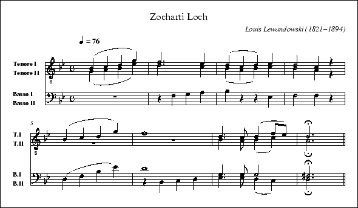]

`V:` can appear both in the body and the header. In the latter case,
`V:` is used exclusively to set voice properties. For example, the
`name` property in the example above, specifies which label should be
printed on the first staff of the voice in question. Note that these
properties may be also set or changed in the
link:#tune_body_definition[tune body]. The `V:` properties are fully
explained link:#voice_properties[below].

Please note that the exact grouping of voices on the staff or staves is
not specified by `V:` itself. This may be specified with the `%%score`
link:#stylesheet_directive_definition[stylesheet directive]. See
link:#voice_grouping[voice grouping] for details.

For playback, see link:#instrumentation_directives[instrumentation
directives] for details of how to assign a General MIDI instrument to a
voice using a `%%MIDI` link:#stylesheet_directive_definition[stylesheet
directive].

Although it is not recommended, the link:#tune_body_definition[tune
body] of fragment `X:1`, could also be notated this way:

[source,code]
----
X:2
T:Zocharti Loch
%...skipping rest of the header...
K:Gm
%               Start of tune body:
V:T1
 (B2c2 d2g2) | f6e2 | (d2c2 d2)e2 | d4 c2z2 |
 (B2c2 d2g2) | f8 | d3c (d2fe) | H d6 ||
V:T2
 (G2A2 B2e2) | d6c2 | (B2A2 B2)c2 | B4 A2z2 |
 z8 | z8 | B3A (B2c2) | H A6 ||
V:B1
 z8 | z2f2 g2a2 | b2z2 z2 e2 | f4 f2z2 |
 (d2f2 b2e'2) | d'8 | g3g  g4 | H^f6 ||
V:B2
 x8 | x8 | x8 | x8 |
 x8 | z2B2 c2d2 | e3e (d2c2) | H d6 ||
----

In the example above, each `V:` label occurs only once, and the complete
part for that voice follows. The output of tune `X:2` will be exactly
the same as the output of tune `X:1`; the source code of `X:1`, however,
is much easier to read.

[[voice_properties]]
7.1 Voice properties
^^^^^^^^^^^^^^^^^^^^

_VOLATILE:_ See link:#multiple_voices[above].

`V:` fields can contain voice specifiers such as name, clef, and so on.
For example,

[source,code]
----
V:T name="Tenor" clef=treble-8
----

indicates that voice `T` will be drawn on a staff labelled `Tenor`,
using the treble clef with a small `8` underneath. Player programs will
transpose the notes by one octave. Possible voice definitions include:

* *name="voice name"* - the voice name is printed on the left of the
first staff only. The characters `\n` produce a newline in the output.
* *subname="voice subname"* - the voice subname is printed on the left
of all staves but the first one.
* *stem=up/down* - forces the note stem direction.
* *clef=* - specifies a clef; see link:#clefs_and_transposition[clefs
and transposition] for details.

The name specifier may be abbreviated to `nm=`. The subname specifier
may be abbreviated to `snm=`.

Applications may implement their own specifiers, but must gracefully
ignore specifiers they don't understand or implement. This is required
for portability of link:#abc_file_definition[abc files] between
applications.

[[breaking_lines]]
7.2 Breaking lines
^^^^^^^^^^^^^^^^^^

_VOLATILE:_ See link:#multiple_voices[above]. In particular the
following may be relaxed with the introduction of a control voice.

The rules for link:#typesetting_line-breaks[typesetting line-breaks] in
multi-voice link:#abc_tune_definition[abc tunes] are the same as for
single voice music although additionally a line-break in one voice must
be matched in the other voices. See the example tune
link:#canzonettaabc[Canzonetta.abc].

[[inline_fields]]
7.3 Inline fields
^^^^^^^^^^^^^^^^^

_VOLATILE:_ See link:#multiple_voices[above].

To avoid ambiguity, link:#inline_field_definition[inline fields] that
specify music properties should be repeated in every voice to which they
apply.

_Example:_

[source,code]
----
[V:1] C4|[M:3/4]CEG|Gce|
[V:2] E4|[M:3/4]G3 |E3 |
----

[[voice_overlay]]
7.4 Voice overlay
^^^^^^^^^^^^^^^^^

_VOLATILE:_ See link:#multiple_voices[above].

The `&` operator may be used to temporarily overlay several voices
within one measure. Each `&` operator sets the time point of the music
back by one bar line, and the notes which follow it form a temporary
voice in parallel with the preceding one. This may only be used to add
one complete bar's worth of music for each `&`.

Example:

[source,code]
----
A2 | c d e f g  a  &\
     A A A A A  A  &\
     F E D C B, A, |]
----

/wiki/_detail/abc:standard:overlay1-80.png?id=abc%3Astandard%3Av2.1[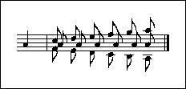]

Words in `w:` lines (and symbols in `s:` lines) are matched to the
corresponding notes as per the normal rules for lyric alignment (see
link:#lyrics[lyrics]), disregarding any overlay in the accompanying
link:#music_code_definition[music code].

_Example:_

[source,code]
----
    g4 f4 | e6 e2 |
&& (d8    | c6) c2|
w: ha-la-| lu-yoh
+: lu-   |   -yoh
----

/wiki/_detail/abc:standard:overlay3-80.png?id=abc%3Astandard%3Av2.1[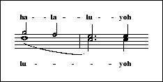]

This revokes the abc 2.0 usage of `&` in `w:` and `s:` lines, which is
now link:#outdated_syntax[deprecated] (see
link:#disallowed_voice_overlay[disallowed]).

'''''

[[abc_data_format]]
8. Abc data format
~~~~~~~~~~~~~~~~~~

Each line in the file may end with white-space which will be ignored.
For the purpose of this standard, ASCII tab and space characters are
equivalent and are both included in the term 'white-space'. Applications
must be able to interpret end-of-line markers in Unix (`<LF>`),
Windows/DOS (`<CR><LF>`), and Macintosh style (`<CR>`) correctly.

[[tune_body]]
8.1 Tune body
^^^^^^^^^^^^^

Within the link:#tune_body_definition[tune body], all the printable
ASCII characters may be used for the link:#music_code_definition[music
code]. These are:

[source,code]
----
 !"#$%&'()*+,-./0123456789:;<=>?@
ABCDEFGHIJKLMNOPQRSTUVWXYZ[\]^_`
abcdefghijklmnopqrstuvwxyz{|}~
----

Of these, the following characters are currently reserved:

[source,code]
----
# * ; ? @
----

In future standards they may be used to extend the abc syntax.

To ensure forward compatibility, current software should ignore these
characters when they appear inside or between note groups, possibly
giving a warning. However, these characters may not be ignored when they
appear inside link:#text_string_definition[text strings] or
link:#information_field_definition[information fields].

_Example:_

[source,code]
----
@a !pp! #bc2/3* [K:C#] de?f "@this $2was difficult to parse?" y |**
----

should be treated as:

[source,code]
----
a !pp! bc2/3 [K:C#] def "@this $2was difficult to parse?" y |
----

[[text_strings]]
8.2 Text strings
^^^^^^^^^^^^^^^^

Text written within an link:#abc_file_definition[abc file],
either as part of an link:#information_field_definition[information
field], an link:#annotations[annotation] or as
link:#free_text_definition[free text] /
link:#typeset_text_definition[typeset text], is known as a **text
string**, or more fully, an **abc text string**. (Note that the abc
standard version 2.0 referred to a link:#text_string_definition[text
string] as an __abc string__.)

Typically when there are several lines of text, each line forms a
separate link:#text_string_definition[text string], although the
distinction is not essential.

The contents of a text string may be written using any legal
link:#charset_field[character set]. The default character set is
`utf-8`, giving access to every Unicode character.

However, not all text editors support `utf-8` and so to avoid
portability problems when writing accented characters in text strings,
it also possible to use three other encoding options:

* *mnemonics* - for example, é can be represented by `\'e`. These
mnemonics are are based on TeX encodings and are always in the format
__backslash-mnemonic-letter__. They have been available since the
earliest days of abc and are widely used in legacy abc files. They are
generally easy to remember and easy to read, but are not comprehensive
in terms of the possible accents they can represent.
* *named html entities* - for example, é can be represented by
`&eacute;`. These encodings are not common in legacy abc files but are
convenient for websites which use abc and generally easy to remember.
However they are not particularly easy to read and are not fully
comprehensive in terms of the possible accents they can represent.
* *fixed width unicode* - for example, é can be represented by `\u00e9`
using the 16-bit unicode representation `00e9` (or `\U000000e9` using
32-bit). These encodings are not common in legacy abc files and are not
easy to read but give comprehensive access to all unicode characters.

All conforming abc typesetting software should support (understand and
be able to convert) the subset of accents and ligatures given in the
appendix, link:#supported_accents_ligatures[supported accents &
ligatures], together with the special characters and symbols listed
below.

A summary, with examples, is as follows:

[cols=",,",options="header",]
|==========================================
|Accent |Examples |Encodings
|grave |`À à è ò` |`\\`A \\`a \\`e \\`o`
|acute |`Á á é ó` |`\'A \'a \'e \'o`
|circumflex |`Â â ê ô` |`\^A \^a \^e \^o`
|tilde |`Ã ã ñ õ` |`\~A \~a \~n \~o`
|umlaut |`Ä ä ë ö` |`\"A \"a \"e \"o`
|cedilla |`Ç ç` |`\cC \cc`
|ring |`Å å` |`\AA \aa`
|slash |`Ø ø` |`\/O \/o`
|breve |`Ă ă Ĕ ĕ` |`\uA \ua \uE \ue`
|caron |`Š š Ž ž` |`\vS \vs \vZ \vz`
|double acute |`Ő ő Ű ű` |`\HO \Ho \HU \Hu`
|ligatures |`ß Æ æ œ` |`\ss \AE \ae \oe`
|==========================================

Programs that have difficulty typesetting accented letters may reduce
them to the base letter or, in the case of ligatures, the two base
letters ignoring the backslash.

_Examples:_ When reduced to the base letter, `\oA` becomes `A`, `\"o`
becomes `o`, `\ss` becomes `ss`, `\AE` becomes `AE`, etc.

For fixed width unicode, `\u` or `\U` must be followed by 4 or 8
hexadecimal characters respectively. Thus if any of the 4 characters
after `\u` is not hexadecimal, then it is interpreted as a breve.

[[special_characters]]
Special characters

Characters that are meaningful in the context of a
link:#text_string_definition[text string] can be escaped using a
backslash as follows:

* type `\\` to get a backslash;
* type `\%` to get a percent symbol that is not interpreted as the start
of a link:#comments_and_remarks[comment];
* type `\&` to get an ampersand that is not interpreted as the start of
a named html entity (although an ampersand followed by white-space is
interpreted as is - for example, `gin & tonic` is OK, but `G\&T`
requires the backslash);
* type `&quot;` or `\u0022` to get double quote marks in an
link:#annotations[annotation]

[[special_symbols]]
Special symbols

The following symbols are also useful:

* type `&copy;` or `\u00a9` for the copyright symbol ©
* type `\u266d` for a flat symbol ♭
* type `\u266e` for a natural symbol ♮
* type `\u266f` for a sharp symbol ♯

_VOLATILE:_ Finally note that currently the specifiers `$1`, `$2`, `$3`
and `$4` can be used to change the font within a
link:#text_string_definition[text string]. However, this feature is
likely to change in future versions of the standard - see
link:#font_directives[font directives] for more details.

'''''

[[macros]]
9. Macros
~~~~~~~~~

This standard defines an *optional* system of macros which is
principally used to define the way in which ornament symbols such as the
tilde `~` are played (although it could be used for many other
purposes).

Software implementing these macros, should first expand the macros
defined in this section, and only afterwards apply any relevant `U:`
replacement (see link:#redefinable_symbols[Redefinable symbols]).

When these macros are stored in an abc header file (see
link:#include_field[include field]), they may form a powerful library.

There are two kinds of macro, called Static and Transposing.

[[static_macros]]
9.1 Static macros
^^^^^^^^^^^^^^^^^

You define a static macro by writing into the
link:#tune_header_definition[tune header] something like this:

[source,code]
----
 m: ~G3 = G{A}G{F}G
----

When you play the tune, the program searches the
link:#tune_header_definition[tune header] for macro definitions, then
does a search and replace on its internal copy of the text before
passing that to the parser which plays the tune. Every occurence of
`~G3` in the tune is replaced by `G{A}G{F}G`, and that is what gets
played. Only `~G3` notes are affected, `~G2`, `~g3`, `~F3` etc. are
ignored.

You can put in as many macros as you want, and indeed, if you only use
static macros you will need to write a separate macro for each
combination of pitch and note-length. Here is an example:

[source,code]
----
X:50
T:Apples in Winter
S:Trad, arr. Paddy O'Brien
R:jig
m: ~g2 = {a}g{f}g
m: ~D2 = {E}D{C}D
M:6/8
K:D
G/2A/2|BEE dEE|BAG FGE|~D2D FDF|ABc ded|
BEE BAB|def ~g2 e|fdB AGF|GEE E2:|
d|efe edB|ege fdB|dec dAF|DFA def|
[1efe edB|def ~g2a|bgb afa|gee e2:|
[2edB def|gba ~g2e|fdB AGF|GEE E2||
----

Here I have put in two static macros, since there are two different
notes in the tune marked with a tilde.

A static macro definition consists of four parts:

* the field identifier `m:`
* the target string - e.g `~G3`
* the equals sign
* the replacement string - e.g. `G{A}G{F}G`

The target string can consist of any string up to 31 characters in
length, except that it may not include the letter 'n', for reasons which
will become obvious later. You don't have to use the tilde, but of
course if you don't use a legal combination of abc, other programs will
not be able to play your tune.

The replacement string consists of any legal abc text up to 200
characters in length. It's up to you to ensure that the target and
replacement strings occupy the same time interval (the program does not
check this). Both the target and replacement strings may include spaces
if necessary, but leading and trailing spaces are stripped off so

[source,code]
----
m:~g2={a}g{f}g
----

is perfectly OK, although less readable.

[[transposing_macros]]
9.2 Transposing macros
^^^^^^^^^^^^^^^^^^^^^^

If your tune has ornaments on lots of different notes, and you want them
to all play with the same ornament pattern, you can use transposing
macros to achieve this. Transposing macros are written in exactly the
same way as static macros, except that the note symbol in the target
string is represented by 'n' (meaning any note) and the note symbols in
the replacement string by other letters (h to z) which are interpreted
according to their position in the alphabet relative to n.

So, for example I could re-write the static macro `m: ~G3 = G{A}G{F}G`
as a transposing macro `m: ~n3 = n{o}n{m}n`. When the transposing macro
is expanded, any note of the form `~n3` will be replaced by the
appropriate pattern of notes. Notes of the form `~n2` (or other lengths)
will be ignored, so you will have to write separate transposing macros
for each note length.

Here's an example:

[source,code]
----
X:35
T:Down the Broom
S:Trad, arr. Paddy O'Brien
R:reel
M:C|
m: ~n2 = (3o/n/m/ n                % One macro does for all four rolls
K:ADor
EAAG~A2 Bd|eg~g2 egdc|BGGF GAGE|~D2B,D GABG|
EAAG ~A2 Bd|eg~g2 egdg|eg~g2 dgba|gedB BAA2:|
~a2ea agea|agbg agef|~g2dg Bgdg|gfga gede|
~a2 ea agea|agbg ageg|dg~g2 dgba|gedB BA A2:|
----

A transposing macro definition consists of four parts:

* the field identifier `m:`
* the target string - e.g `~n3`
* the equals sign
* the replacement string - e.g. `n{o}n{m}n`

The target string can consist of any string up to 31 characters in
length, except that it must conclude with the letter 'n', followed by a
number which specifies the note length.

The replacement string consists of any legal abc text up to 200
characters in length, where note pitches are defined by the letters h -
z, the pitches being interpreted relative to that of the letter n. Once
again you should ensure that the time intervals match. You should not
use accidentals in transposing macros

_Comment:_ It is almost impossible to think of a way to transpose `~=a3`
or `~^G2` which will work correctly under all circumstances, so a static
macro should be used for cases like these.

'''''

[[outdated_syntax]]
10. Outdated syntax
~~~~~~~~~~~~~~~~~~~

The abc standard contains a variety of outdated syntax that is no longer
recommended or, in some cases even supported, according to the following
definitions:

* *Deprecated* syntax is rules or constructs that have been outdated by
newer syntax. Deprecated syntax must be supported by conforming abc
software under strict interpretation but is not recommended for new
transcriptions. Deprecated syntax may become obsolete in future versions
of abc. Conforming abc software that encounters deprecated syntax should
issue a warning when using strict interpretation (although it may offer
the user the option to switch warnings off).
* *Obsolete* syntax is rules or constructs for which there is no
guarantee of support by conforming abc software. Obsolete syntax may be
supported under loose interpretation but must not be used for new
transcriptions. Conforming abc software that encounters obsolete syntax
should issue a (preferably non-fatal) error message when using strict
interpretation, or a warning when using loose interpretation (although
it may offer the user the option to switch warnings off).
* *Disallowed* syntax has the same definition as obsolete syntax, but
has not gone through a formal process of deprecation.
* *Outdated* syntax is the collective term for deprecated, obsolete and
disallowed syntax.

Please see http://www.ietf.org/rfc/rfc2119.txt for formal definitions of
the key words MUST, MUST NOT, REQUIRED, SHALL, SHALL NOT, SHOULD, SHOULD
NOT, RECOMMENDED, MAY, and OPTIONAL in this context.

Outdated abc syntax is listed below so that users who come across it are
able to interpret (and preferably update) it according to the latest
standard.

[[outdated_information_field_syntax]]
10.1 Outdated information field syntax
^^^^^^^^^^^^^^^^^^^^^^^^^^^^^^^^^^^^^^

The `A:` link:#aarea[field] was originally used to contain area
information. In version 2.0 this was changed to contain the name of the
lyrics author. In version 2.1, to maintain backwards compatibility, this
has been changed back to area, but for clarity, the `A:` field is
link:#outdated_syntax[deprecated] - area information can be stored in
the `O:` field and a new field _(to be decided)_ will be used for author
information.

_Comment:_ Of the 160,000 tunes currently available in the
http://abcnotation.com/search[abcnotation.com tune search] 16,300
contain an `A:` field with 680 distinct values. Of these, only around 10
contain author information rather than area (in some cases it is
difficult to tell).

An `E:` field was once used by `abc2mtex` to explicitly control note
spacing; this is no longer necessary with current formatting algorithms
and the `E:` field is now link:#outdated_syntax[deprecated].

The original usage of the `H:` link:#hhistory[history] field, where the
contents of the history field is considered to continue over several
lines until the next field occurs, is now
link:#outdated_syntax[deprecated].

The `Q:` link:#qtempo[tempo] field is still very much in use, but
earlier versions of the standard permitted two syntax variants, now
link:#outdated_syntax[deprecated], which specified how many unit note
lengths to play per minute.

_Examples:_ Both examples mean "play 120 unit note-lengths per minute".

[source,code]
----
Q:C=120
Q:120
----

This is not very musical, and the usage is
link:#outdated_syntax[deprecated]. However, there are many
link:#abc_file_definition[abc files] which employ this syntax and
programs should accept it.

[[outdated_dialects]]
10.2 Outdated dialects
^^^^^^^^^^^^^^^^^^^^^^

[[outdated_line-breaking]]
10.2.1 Outdated line-breaking
+++++++++++++++++++++++++++++

The popular abc software abc2win introduced an exclamation mark (`!`) as
a way of forcing a link:#score_line-break_definition[score line-break]
and this was adopted by abc 2.0, conflicting with the previous usage of
`!…!` to delimit decorations.

The `!` is now link:#outdated_syntax[deprecated] for
link:#score_line-break_definition[score line-breaks] although it is
still available (even under link:#strict_interpretation[strict
interpretation]) for legacy abc transcriptions by use of the
"`I:linebreak !`" directive - see
link:#line-breaking_dialects[line-breaking dialects].

[[outdated_decorations]]
10.2.2 Outdated decorations
+++++++++++++++++++++++++++

Abc standard 2.0 adopted `+…+` syntax to indicate decorations in place
of `!…!`. It never gained much favour, however, and the latter is in
much more common (see link:#decoration_dialects[decoration dialects]).

Therefore, and since a non-conflicting mechanism has now been found to
allow `!` for line-breaking (see
link:#line-breaking_dialects[line-breaking dialects]), the `+…+`
decoration syntax is now link:#outdated_syntax[deprecated] in favour of
`!…!`.

Nonetheless, the `+…+` decoration syntax is still available using the
"`I:decoration +`" instruction (see link:#decoration_dialects[decoration
dialects]).

[[outdated_chords]]
10.2.3 Outdated chords
++++++++++++++++++++++

Early versions of the abc standard used the `+` symbol to delimit chords
(in place of `[]` symbols). This usage is now
link:#outdated_syntax[deprecated] - see link:#chord_dialects[chord
dialects] for more details.

[[outdated_continuations]]
10.3 Outdated continuations
^^^^^^^^^^^^^^^^^^^^^^^^^^^

From the earliest days of abc (in abc standard 1.0 through to abc
1.7.6), the backslash (`\`) has been used to suppress
link:#score_line-break_definition[score line-breaks] by placing it at
the end of a line of link:#music_code_definition[music code]. Thus,
effectively, it has acted as a continuation character, although with its
own special rules, in particular that it could act through
link:#information_field_definition[information fields] and
link:#comment_definition[comments].

Abc 2.0 extended this usage to make `\` a general continuation
character, which also allows continuation of
link:#information_field_definition[information fields] and in particular
the `w:` lyrics field (usually the only field which actually requires a
continuation in typical transcriptions). Unfortunately, however, the
rules of precedence were never well established (should the `\` be
treated by a pre-processor joining together continued lines and, if so,
should comments be removed before or after that happened?) and the usage
was never widely adopted, nor even well understood.

_Comment:_ Of the 160,000 tunes currently available in the
http://abcnotation.com/search[abcnotation.com tune search], only 22
(0.01%) use continuations for the `w:` field and only around 50 (0.03%)
use it for any other field; of these latter usages, almost all are
actually in error.

Furthermore, discussions during the development of abc 2.1 led to the
suggestion that a new character should be introduced to suppress
link:#score_line-break_definition[score line-breaks] - in other words
the `\` (as described in abc 2.0) had evolved far enough away from its
initial definition so that another character was required to replace
what it had originally been designed to do.

Consequently, in abc 2.1 the `\` has been reinstated to its original
purpose of suppressing link:#score_line-break_definition[score
line-breaks] (see link:#typesetting_line-breaks[typesetting
line-breaks]) and its use a general continuation character is now
link:#outdated_syntax[disallowed] (see
link:#continuation_of_input_lines[continuation of input lines] for the
alternatives).

[[outdated_directives]]
10.4 Outdated directives
^^^^^^^^^^^^^^^^^^^^^^^^

The `%%continueall true` directive is replaced by "`I:linebreak !`" in
abc 2.1 (see link:#typesetting_line-breaks[typesetting line-breaks]) and
link:#outdated_syntax[deprecated].

The `%%abc-copyright` and `%%abc-edited-by` extended information fields
from section 3.3. of abc 2.0 have been link:#outdated_syntax[deprecated]
in favour of the link:#ztranscription[Z: - transcription] field.

_Comment:_ Of the 131,000 files currently available in the
http://abcnotation.com/search[abcnotation.com tune search] only 32 use
`%%abc-edited-by` and only 1 uses `%%abc-copyright`.

[[outdated_file_structure]]
10.5 Outdated file structure
^^^^^^^^^^^^^^^^^^^^^^^^^^^^

[[outdated_tune_header_syntax]]
10.5.1 Outdated tune header syntax
++++++++++++++++++++++++++++++++++

Abc standard 2.0 included the rule that 'if the
link:#abc_file_definition[abc file] contains only one tune the `X:`
field may be dropped'. However, it was pointed out that as a
consequence, a user who pasted an additional tune into such a file would
get an error message from a tune which previously contained no errors.

Despite considerable discussion on the abcusers mail list (see for
example the threads
http://tech.groups.yahoo.com/group/abcusers/message/3950 and
http://tech.groups.yahoo.com/group/abcusers/message/4113) and, a number
of good suggestions, no consensus was reached. As a result the above
rule is link:#outdated_syntax[deprecated] in abc 2.1; a tune must start
with a `X:` field followed by a `T:` field.

However, this decision may be revisited in the future and the
specification relaxed.

[[outdated_defaults]]
10.5.2 Outdated defaults
++++++++++++++++++++++++

In early versions of the abc standard, defaults could be set throughout
an link:#abc_file_definition[abc file], using
link:#information_field_definition[information fields], which applied to
all subsequent tune. In other words, the
link:#file_header_definition[file header] could effectively appear
anywhere inside a file instead of just at the top.

This usage significantly complicates random access of the tunes in the
file, since the all the preceding contents of the file must be scanned
for default settings before a tune can be processed. As result this was
link:#outdated_syntax[deprecated] in abc 2.0 and is
link:#outdated_syntax[deprecated] in abc 2.1.

[[outdated_lyrics_alignment]]
10.6 Outdated lyrics alignment
^^^^^^^^^^^^^^^^^^^^^^^^^^^^^^

Abc 2.1 introduced an extension to link:#alignment[lyrics alignment]
meaning that lyric lines (i.e. those using the `w:` field) no longer
need to follow immediately after the line of
link:#music_code_definition[music code] to which they are attached,
meaning that they can even be postponed to the end of the
link:#tune_body_definition[tune body].

_Examples:_ The following two excerpts are equivalent in abc 2.1; under
abc 2.0 and previous versions of the standard, only the first version
would be legal. Note that there are 4 (link:#numbering[numbered]) verses
and hence 4 `w:` fields for each line of
link:#music_code_definition[music code].

In the first excerpt the lyrics follow immediately after the line of
link:#music_code_definition[music code] to which they are attached.

In the second excerpt, the lyrics are postponed to the end of the tune,
arguably aiding readability substantially and meaning that each verse is
contiguous. The link:#comment_definition[comment lines] in the second
excerpt (those lines beginning with `%`) are added for readability and
are entirely optional.

[source,code]
----
D2DE G2GG|A2EE ED-D2|c2cc B2AG|
w:1\-~Si les ma-tins de gri-sail-le se tein-tent,*s'ils ont cou-leur en la
w:2\-~Si mo-ri-bonds sont les rois en ri-pail-le,*si leurs pri-sons sont des
w:3\-~Si mill' so-leils de mé-tal pren-nent voi-le,*dix mill' so-leils de cris-
w:4\-~Si mill' bri-gands à l'en-can font par-ta-ge,*dix mille en-fants des tor-
A2B^c d4|e2ee d2BA|G2EF GABc|
w:nuit qui s'é-teint, vien-dront d'o-pal's len-de-mains, re-vien-dront les siè-cles
w:ca-ges sans fond, vien-ne l'heur' des é-va-sions,******
w:\-tal font mer-veille vienn'nt des lu-eurs de ver-meil,******
w:\-rents font ar-gent, vien-nent des fleurs de sa-fran,******
----

[source,code]
----
%
% music
%
D2DE G2GG|A2EE ED-D2|c2cc B2AG|
A2B^c d4|e2ee d2BA|G2EF GABc|
%
% lyrics
%
w:1\-~Si les ma-tins de gri-sail-le se tein-tent,*s'ils ont cou-leur en la
+:nuit qui s'é-teint, vien-dront d'o-pal's len-de-mains, re-vien-dront les siè-cles
%
w:2\-~Si mo-ri-bonds sont les rois en ri-pail-le,*si leurs pri-sons sont des
+:ca-ges sans fond, vien-ne l'heur' des é-va-sions,******
%
w:3\-~Si mill' so-leils de mé-tal pren-nent voi-le,*dix mill' so-leils de cris-
+:\-tal font mer-veille vienn'nt des lu-eurs de ver-meil,******
%
w:4\-~Si mill' bri-gands à l'en-can font par-ta-ge,*dix mille en-fants des tor-
+:\-rents font ar-gent, vien-nent des fleurs de sa-fran,******
----

Unfortunately, however, this extension is not fully backwards compatible
with abc 2.0.

The difficulty arises when there is a line (or lines) of music code
without lyrics attached, followed by a line with lyrics attached.

_Example:_ In the following excerpt, using abc 2.0 the lyrics would be
aligned with the adjacent link:#music_code_definition[music code], i.e.
with `cdef`; using abc 2.1 they would be aligned at the start of the
tune (or voice), i.e. with `CDEF`.

[source,code]
----
CDEF|
FEDC|
cdef|]
w:these are lyr-ics
----

The work around for users who have files with such usage is either to
avoid writing `%abc-2.1` as the link:#abc_file_identification[file
identifier] or to add an empty `w:` field after the final line of
link:#music_code_definition[music code] that should be without lyrics.

_Example:_ The following excerpt should be treated the same way (with
regard to lyrics alignment) under abc 2.0 and abc 2.1. Under abc 2.1 the
empty `w:` field means that the lyrics are aligned with `cdef`.

[source,code]
----
CDEF|
FEDC|
w:
cdef|]
w:these are lyr-ics
----

[[other_outdated_syntax]]
10.7 Other outdated syntax
^^^^^^^^^^^^^^^^^^^^^^^^^^

[[disallowed_voice_overlay]]
10.7.1 Disallowed voice overlay
+++++++++++++++++++++++++++++++

Although the use of ampersand (`&`) to overlay voices (as introduced in
abc 2.0) is still perfectly acceptable, this usage has been
link:#outdated_syntax[deprecated] within `w:` lyric and `s:` symbol
link:#information_field_definition[information fields].

The reason is that, as far as is known, this usage has never been
implemented in software and, furthermore, `&` symbols are widely used
within `w:` fields in legacy abc files to indicate ampersands.

Instead lyrics are matched to notes without regard to the voice overlay
- see link:#voice_overlay[voice overlay].

'''''

[[stylesheet_directives_and_pseudo-comments]]
11. Stylesheet directives and pseudo-comments
~~~~~~~~~~~~~~~~~~~~~~~~~~~~~~~~~~~~~~~~~~~~~

[[introduction_to_directives]]
11.0 Introduction to directives
^^^^^^^^^^^^^^^^^^^^^^^^^^^^^^^

[[disclaimer]]
11.0.1 Disclaimer
+++++++++++++++++

In the early days of abc, pseudo-comments (lines starting with `%%`)
were introduced as a means of adding software-specific information and
formatting instructions into link:#abc_file_definition[abc files];
because they started with a `%` symbol software that didn't recognise
them would ignore them as a link:#comment_definition[comment].

In a valiant effort, abc 2.0 made an attempt to standardise these
pseudo-comments with the introduction
link:#stylesheet_directive_definition[stylesheet directives] and the abc
stylesheet specification. This was described as "not part of the ABC
specification itself" but as "an additional standard" containing
directives to control how the content and structural information
described by the abc code "is to be actually rendered, for example by a
typesetting or player program".

Unfortunately, however, there are a very large number of pseudo-comment
directives and not all of them are well-defined. Furthermore, some
directives, in particular the link:#text_directives[text directives] and
link:#accidental_directives[accidental directives], actually contain
content and / or structural information (as opposed to rendering
instructions).

Abc 2.1 has stepped away from this approach somewhat.

The pseudo-comments are still very much accepted as a way for developers
to introduce experimental features and software-specific formatting
instructions. However, when a directive gains acceptance, either by
being implemented in more than one piece of software, or by its use in a
substantial body of tunes, the aim is that the usage will be
standardised and adopted in the standard and the `I:`
link:#iinstruction[instruction] form recommended in place of the `%%`
pseudo-comment form.

In particular, it is intended that abc 2.3 will address markup and
embedding and at that point a number of the text-based directives,
together with other widely accepted forms, will be formally
incorporated.

For the moment, section 11 is retained mostly unchanged from abc 2.0
(save for typo corrections) but, as a result of the foregoing, the whole
of section 11 and all stylesheet directives should regarded as
__VOLATILE__.

[[stylesheet_directives]]
11.0.2 Stylesheet directives
++++++++++++++++++++++++++++

A *stylesheet directive* is a line that starts with `%%`,
followed by a directive that gives instructions to typesetting or player
programs.

_Examples:_

[source,code]
----
%%papersize A4
%%newpage
%%setbarnb 10
----

Alternatively, any link:#stylesheet_directive_definition[stylesheet
directive] may be written as an `I:instruction` field although this is
not recommended for usages which have not been standardised (i.e. it is
not recommended for any directives described in section 11).

_Examples:_ Not recommended.

[source,code]
----
I:papersize A4
I:newpage
I:setbarnb 10
----

link:#inline_field_definition[Inline field] notation may be used to
place a link:#stylesheet_directive_definition[stylesheet directive] in
the middle of a line of music:

_Example:_

[source,code]
----
CDEFG|[I:setbarnb 10]ABc
----

If a program doesn't recognise a
link:#stylesheet_directive_definition[stylesheet directive], it should
just ignore it.

It should be stressed that the
link:#stylesheet_directive_definition[stylesheet directives] are not
formally part of the abc standard itself. Furthermore, the list of
possible link:#stylesheet_directive_definition[directives] is long and
not standardised. They are provided by a variety of programs for
specifying layout, text annotations, fonts, spacings, voice instruments,
transposition and other details.

Strictly speaking, abc applications don't have to conform to the same
set of link:#stylesheet_directive_definition[stylesheet directives].
However, it is desirable that they do in order to make
link:#abc_file_definition[abc files] portable between different computer
systems.

[[voice_grouping]]
11.1 Voice grouping
^^^^^^^^^^^^^^^^^^^

_VOLATILE:_ This section is under review as part of the general
discussion about link:#multiple_voices[multiple voices] for abc 2.2. See
also the link:#disclaimer[section 11 disclaimer].

Basic syntax:

[source,code]
----
%%score <voice-id1> <voice-id2> ... <voice-idn>
----

The score directive specifies which voices should be printed in the
score and how they should be grouped on the staves.

Voices that are enclosed by parentheses `()` will go on one staff.
Together they form a voice group. A voice that is not enclosed by
parentheses forms a voice group on its own that will be printed on a
separate staff.

If voice groups are enclosed by curly braces `{}`, the corresponding
staves will be connected by a big curly brace printed in front of the
staves. Together they form a voice block. This format is used especially
for typesetting keyboard music.

If voice groups or braced voice blocks are enclosed by brackets `[]`,
the corresponding staves will be connected by a big bracket printed in
front of the staves. Together they form a voice block.

If voice blocks or voice groups are separated from each other by a `|`
character, continued bar lines will be drawn between the associated
staves.

Example:

[source,code]
----
%%score Solo  [(S A) (T B)]  {RH | (LH1 LH2)}
----

If a single voice surrounded by two voice groups is preceded by a star
(`*`), the voice is marked to be floating. This means that the voice
won't be printed on it's own staff; rather the software should
automatically determine, for each note of the voice, whether it should
be printed on the preceding staff or on the following staff.

Software that does not support floating voices may simply print the
voice on the preceding staff, as if it were part of the preceding voice
group.

Examples:

[source,code]
----
%%score {RH *M| LH}
%%score {(RH1 RH2) *M| (LH1 LH2)}
----

String parts in an orchestral work are usually bracketed together and
the top two (1st/2nd violins) then braced outside the bracket:

[source,code]
----
%%score [{Vln1 | Vln2} | Vla | Vc | DB]
----

Any voices appearing in the link:#tune_body_definition[tune body] will
only be printed if it is mentioned in the score directive.

When the score directive occurs within the
link:#tune_body_definition[tune body], it resets the music generator, so
that voices may appear and disappear for some period of time.

If no score directive is used, all voices that appear in the
link:#tune_body_definition[tune body] are printed on separate staves.

See link:#canzonettaabc[Canzonetta.abc] for an extensive example.

An alternative directive to `%%score` is `%%staves`.

Both `%%score` and `%%staves` directives accept the same parameters, but
measure bar indications work the opposite way. Therefore,
`%%staves [S|A|T|B]` is equivalent to `%%score [S A T B]` and means that
continued bar lines are not drawn between the associated staves, while
`%%staves [S A T B]` is equivalent to `%%score [S|A|T|B]` and means that
they are drawn.

[[instrumentation_directives]]
11.2 Instrumentation directives
^^^^^^^^^^^^^^^^^^^^^^^^^^^^^^^

_VOLATILE:_ See the link:#disclaimer[section 11 disclaimer].

[source,code]
----
%%MIDI voice [<ID>] [instrument=<integer> [bank=<integer>]] [mute]
----

Assigns a MIDI instrument to the indicated abc voice. The MIDI
instruments are organized in banks of 128 instruments each. Both the
instruments and the banks are numbered starting from one.

The General MIDI (GM) standard defines a portable, numbered set of 128
instruments (numbered from 1-128) - see
http://www.midi.org/techspecs/gm1sound.php. The GM instruments can be
used by selecting bank one. Since the contents of the other MIDI banks
is platform dependent, it is highly recommended to only use the first
MIDI bank in tunes that are to be distributed.

The default bank number is 1 (one).

_Example:_ The following assigns GM instrument 59 (tuba) to voice 'Tb'.

[source,code]
----
%%MIDI voice Tb instrument=59
----

If the voice ID is omitted, the instrument is assigned to the current
voice.

_Example:_

[source,code]
----
M:C
L:1/8
Q:1/4=66
K:C
V:Rueckpos
%%MIDI voice instrument=53 bank=2
A3B    c2c2    |d2e2    de/f/P^c3/d/|d8    |z8           |
V:Organo
%%MIDI voice instrument=73 bank=2
z2E2-  E2AG    |F2E2    F2E2        |F6  F2|E2CD   E3F/G/|
----

You can use the keyword `mute` to mute the specified voice.

Some abc players can automatically generate an accompaniment based on
the link:#chord_symbols[chord symbols] specified in the melody line. To
suggest a GM instrument for playing this accompaniment, use the
following directive:

[source,code]
----
%%MIDI chordprog 20 % Church organ
----

[[accidental_directives]]
11.3 Accidental directives
^^^^^^^^^^^^^^^^^^^^^^^^^^

_VOLATILE:_ This section is under active discussion. See also the
link:#disclaimer[section 11 disclaimer].

[source,code]
----
%%propagate-accidentals not | octave | pitch
----

When set to `not`, accidentals apply only to the note they're attached
to. When set to `octave`, accidentals also apply to all the notes of the
same pitch in the same octave up to the end of the bar. When set to
`pitch`, accidentals also apply to all the notes of the same pitch in
all octaves up to the end of the bar.

The default value is `pitch`.

[source,code]
----
%%writeout-accidentals none | added | all
----

When set to `none`, modifying or explicit accidentals that appear in the
key signature field (`K:`) are printed in the key signature. When set to
`added`, only the accidentals belonging to the mode indicated in the
`K:` field, are printed in the key signature. Modifying or explicit
accidentals are printed in front of the notes to which they apply. When
set to `all`, both the accidentals belonging to the mode and possible
modifying or explicit accidentals are printed in front of the notes to
which they apply; no key signature will be printed.

The default value is `none`.

[[formatting_directives]]
11.4 Formatting directives
^^^^^^^^^^^^^^^^^^^^^^^^^^

_VOLATILE:_ See the link:#disclaimer[section 11 disclaimer].

Typesetting programs should accept the set of directives in the next
sections. The parameter of a directive can be a
link:#text_string_definition[text string], a logical value `true` or
`false`, an integer number, a number with decimals (just 'number' in the
following), or a unit of length. Units can be expressed in cm, in, and
pt (points, 1/72 inch).

The following directives should be self-explanatory.

[[page_format_directives]]
11.4.1 Page format directives
+++++++++++++++++++++++++++++

_VOLATILE:_ See the link:#disclaimer[section 11 disclaimer].

[source,code]
----
%%pageheight       <length>
%%pagewidth        <length>
%%topmargin        <length>
%%botmargin        <length>
%%leftmargin       <length>
%%rightmargin      <length>
%%indent           <length>
%%landscape        <logical>
----

[[font_directives]]
11.4.2 Font directives
++++++++++++++++++++++

_VOLATILE:_ Font directives are due to be considered in abc 2.3 - see
the link:#disclaimer[section 11 disclaimer].

PostScript and PDF are the standard file formats for distributing
printable material. For portability reasons, typesetters will use the
PostScript font names. The size parameter should be an integer, but is
optional.

[source,code]
----
%%titlefont        <font name>  <size>
%%subtitlefont     <font name>  <size>
%%composerfont     <font name>  <size>
%%partsfont        <font name>  <size>
%%tempofont        <font name>  <size>
%%gchordfont       <font name>  <size> % for chords symbols
%%annotationfont   <font name>  <size> % for "^..." annotations
%%infofont         <font name>  <size>
%%textfont         <font name>  <size>
%%vocalfont        <font name>  <size> % for w:
%%wordsfont        <font name>  <size> % for W:
----

The specifiers `$1`, `$2`, `$3` and `$4` can be used to change the font
within a link:#text_string_definition[text string]. The font to be used
can be specified with the `%%setfont-n` directives. `$0` resets the font
to its default value. `$$` gives an actual dollar sign.

[source,code]
----
%%setfont-1        <font name>  <size>
%%setfont-2        <font name>  <size>
%%setfont-3        <font name>  <size>
%%setfont-4        <font name>  <size>
----

[[space_directives]]
11.4.3 Space directives
+++++++++++++++++++++++

_VOLATILE:_ See the link:#disclaimer[section 11 disclaimer].

[source,code]
----
%%topspace         <length>
%%titlespace       <length>
%%subtitlespace    <length>
%%composerspace    <length>
%%musicspace       <length> % between composer and 1st staff
%%partsspace       <length>
%%vocalspace       <length>
%%wordsspace       <length>
%%textspace        <length>
%%infospace        <length>
%%staffsep         <length> % between systems
%%sysstaffsep      <length> % between staves in the same system
%%barsperstaff     <integer>
%%parskipfac       <number> % space between parts
%%lineskipfac      <number> % space between lines of text
%%stretchstaff     <logical>
%%stretchlast      <logical>
%%maxshrink        <number> % shrinking notes
%%scale            <number>
----

[[measure_directives]]
11.4.4 Measure directives
+++++++++++++++++++++++++

_VOLATILE:_ See the link:#disclaimer[section 11 disclaimer].

[source,code]
----
%%measurefirst     <integer> % number of first measure
%%barnumbers       <integer> % bar numbers every 'n' measures
%%measurenb        <integer> % same as %%barnumbers
%%measurebox       <logical>
%%setbarnb         <integer> % set measure number
----

[[text_directives]]
11.4.5 Text directives
++++++++++++++++++++++

_VOLATILE:_ Text directives are due to be considered in abc 2.3 - see
the link:#disclaimer[section 11 disclaimer].

The following directives can be used for inserting
link:#typeset_text_definition[typeset text] within an
link:#abc_file_definition[abc file].

[source,code]
----
%%text             <text string>
%%center           <text string>
%%begintext
%%...              <text string>
%%endtext
----

Notes:

* `%%text` prints the following text, treated as a
link:#text_string_definition[text string].
* `%%center` prints the following text, treated as a
link:#text_string_definition[text string] and centred.
* `%%begintext` and `%%endtext` mark a section of lines, each of which
start with `%%`, followed by some text. It is an alternative to several
`%%text` lines. [__Important note:__ some
link:#abc_extensions[extensions] offered by abc software programs relax
the rule that each line between `%%begintext` and `%%endtext` must start
with `%%`. Whilst this should not cause problems for
link:#typeset_text_definition[typeset text] between tunes,
link:#typeset_text_definition[typeset text] within a
link:#tune_header_definition[tune header] or
link:#tune_body_definition[tune body] should respect this rule and, in
particular, must not introduce blank lines.]

See link:#further_information_about_directives[further information about
directives] for more details and to find out about additional parameters
for these directives.

_Recommendation for users:_ If you are using text directives for
tune-specific information, consider instead using one of the
link:#bdfsbackground_information[background information fields] together
with a `%%writefields` directive (see
link:#information_directives[information directives]) so that the
information can correctly identified by databasing software.

[[information_directives]]
11.4.6 Information directives
+++++++++++++++++++++++++++++

_VOLATILE:_ The `%%writefields` directive and its formatting options are
likely to be enhanced when markup is considered in abc 2.3. See also the
link:#disclaimer[section 11 disclaimer].

[source,code]
----
%%writefields <list of field identifiers> [<logical>]
----

The `%%writefields` directive allows users to choose which string-type
link:#information_field_definition[information fields] appear in the
printed score (see the link:#information_fields[information fields]
table for a list of string-type fields). It is followed by a list of
field identifiers and, optionally, the logical value `true` or `false`.
If the logical value is missing it is taken as `true`.

The `%%writefields` directive also applies to certain instruction fields
- namely `X:reference number`, `P:parts` and `Q:tempo`.

The default is "`%%writefields TCOPQwW`" meaning that the title (T),
composer (C), origin (O), parts (P), tempo (Q), aligned words (w) and
other words (W) are printed out by default (see
link:#typesetting_information_fields[typesetting information fields] for
how these should be typeset). Each subseqent `%%writefields` directive
combines with this list, rather than overriding it.

_Examples:_

[source,code]
----
%%writefields O false         % the O field is not printed out - other defaults remain
%%writefields X               % the X: field is printed out
%%writefields BCDFGHNORSTWwXZ % all string-type fields are printed out
----

Typesetting software conforming to abc 2.1 may format the information
strings in any way it chooses.

_Comment:_ The `%%writefields` directive can be used in place of a
number of directives introduced in abc 2.0:

* "`%%writefields X`" can be used as an alternative to "`%%withxrefs`"
* "`%%writefields Ww false`" can be used as an alternative
to"`%%musiconly`"
* "`%%writefields`" is a partial alternative to "`%%writehistory`" and
"`%%infoname`"

See link:#further_information_about_directives[further information about
directives] for more details of the 2.0 alternatives.

[[separation_directives]]
11.4.7 Separation directives
++++++++++++++++++++++++++++

_VOLATILE:_ See the link:#disclaimer[section 11 disclaimer].

[source,code]
----
%%sep     % draw a horizontal separator, i.e. a line
%%vskip   % insert some vertical space
%%newpage % start a new page
----

See link:#further_information_about_directives[further information about
directives] for more details and to find out about additional parameters
for these directives.

[[miscellaneous_directives]]
11.4.8 Miscellaneous directives
+++++++++++++++++++++++++++++++

_VOLATILE:_ See the link:#disclaimer[section 11 disclaimer].

[source,code]
----
%%exprabove        <logical>
%%exprbelow        <logical>
%%graceslurs       <logical> % grace notes slur to main note
%%infoline         <logical> % rhythm and origin on the same line
%%oneperpage       <logical>
%%vocalabove       <logical>
%%freegchord       <logical> % print '#', 'b' and '=' as they are
%%printtempo       <logical>
----

The default value for these directives is false.

[[application_specific_directives]]
11.5 Application specific directives
^^^^^^^^^^^^^^^^^^^^^^^^^^^^^^^^^^^^

Applications may introduce their own directives. These directives should
start with the name of the application, followed a colon, folowed by the
name of the directive.

_Example:_

[source,code]
----
%%noteedit:fontcolor blue
----

[[further_information_about_directives]]
11.6 Further information about directives
^^^^^^^^^^^^^^^^^^^^^^^^^^^^^^^^^^^^^^^^^

Since link:#stylesheet_directive_definition[stylesheet directives] are
not formally part of the abc standard, only a subset is included here.
For additional directives and further information about those listed
here, see the user manuals for programs that implement them, in
particular:

* the `format.txt` file included with http://moinejf.free.fr/[abcm2ps]
* the `abcguide.txt` file included with
http://abc.sourceforge.net/abcMIDI/[abcMIDI]
* the `abctab2ps`
http://www.lautengesellschaft.de/cdmm/userguide/userguide.html[User's
guide]

'''''

[[dialects_strict_loose_interpretation_and_backwards_compatibility]]
12. Dialects, strict / loose interpretation and backwards compatibility
~~~~~~~~~~~~~~~~~~~~~~~~~~~~~~~~~~~~~~~~~~~~~~~~~~~~~~~~~~~~~~~~~~~~~~~

Unfortunately a number of dialects of abc have arisen over the years,
partly due to differences in implementation, together with unfinished
drafts of the abc standard and ambiguities within it.

Version 2.1 of the standard aims to address this fragmentation of abc
notation with a robust, but tolerant approach that should accommodate as
many users as possible for several years to come and, as far as
possible, restore backwards compatibility.

There are three main approaches:

* the introduction of new `I:` directives to allow for preferences in
dialects;
* the concepts of strict and loose interpretation of the standard
(together with recommendations to software developers for dealing with
loose interpretations);
* statistically-based decisions about default settings.

The aim is that, even under strict interpretation, most current dialects
are still available via the new `I:` directives.

_Comment:_ Dialects not available under strict interpretation are those
where one symbol is used for two different purposes - for example, a `!`
symbol used to denote both line-breaks and decorations; fortunately, of
the 160,000 tunes currently available in the
http://abcnotation.com/search[abcnotation.com tune search] only around
60 (0.04%) employ this usage.

[[dialect_differences]]
12.1 Dialect differences
^^^^^^^^^^^^^^^^^^^^^^^^

The main differences that have arisen are line-breaks, decoration
delimiters and chord delimiters.

[[line-breaking_dialects]]
12.1.1 Line-breaking dialects
+++++++++++++++++++++++++++++

By default, a (forced) link:#score_line-break_definition[score
line-break] is typeset by using a link:#code_line-break_definition[code
line-break] - see link:#typesetting_line-breaks[typesetting
line-breaks].

In the past the `!` symbol has instead been used to indicate
link:#score_line-break_definition[score line-breaks] - this symbol is
now used to denote decorations.

_Comment:_ The `!` symbol was introduced by abc2win, a very popular
program in its time, although now moribund. Of the 160,000 tunes
currently available in the http://abcnotation.com/search[abcnotation.com
tune search], only around 1,600 (10%) use the ! symbol to denote
line-breaks.

Although the use of the `!` symbol for line-breaking is now
link:#outdated_syntax[deprecated] (see
link:#outdated_line-breaking[outdated line-breaking]), users who wish to
continue using the `!` symbol for line-breaking merely need to include
the "`I:linebreak !`" directive, either in the
link:#file_header_definition[file header] or individually tune by tune -
see link:#typesetting_line-breaks[typesetting line-breaks].

_Example:_ The following abc code would result in two lines of music.

[source,code]
----
I:linebreak !
K:G
ABC DEF|!FED ABC|]
----

Finally a new line-breaking symbol, `$`, has been introduced as an
alternative to using link:#code_line-break_definition[code line-breaks].

_Comment:_ The `$` symbol is effectively a replacement for `!`. It is
aimed at those users who want `!` as the decoration delimiter but who
prefer to use link:#code_line-break_definition[code line-breaks] without
generating corresponding link:#score_line-break_definition[score
line-breaks].

[[decoration_dialects]]
12.1.2 Decoration dialects
++++++++++++++++++++++++++

Decorations are delimited using the `!` symbol - see
link:#decorations[decorations].

In the past the `+` symbol has instead been used to denote decorations -
this symbol is now link:#outdated_syntax[deprecated] for decorations.

_Comment:_ Decorations were first introduced in draft standard 1.7.6
(which was never formally adopted) with the `!` symbol. In abc 2.0
(adopted briefly whilst discussions about abc 2.1 were taking place)
this was changed to the `+` symbol. Neither are in widespread use, but
the `!` symbol is much more common - of the 160,000 tunes currently
available in the http://abcnotation.com/search[abcnotation.com tune
search], only around 100 (0.07%) use the `+` symbol to delimit
decorations, whereas around 1,350 (0.85%) use the `!` symbol.

Users who wish to continue using the `+` symbol for decorations merely
need to include the "`I:decoration +`" directive, either in the
link:#file_header_definition[file header] or individually tune by tune -
see link:#decorations[decorations]. All `+…+` decorations will then be
treated as if they were the corresponding `!…!` decoration and any `!…!`
decorations will generate an error message.

Note that the "`I:decoration +`" directive is automatically invoked by
the "`I:linebreak !`" directive. Also note that the `!+!` decoration has
no `+` equivalent - `+plus+` should be used instead.

_Recommendation for users:_ Given the very small uptake of the `+`
symbol for decorations, "`I:decoration +`" directive is not recommended.
However, it is retained for users who wish to use the `!` symbol for
line-breaking in legacy link:#abc_file_definition[abc files].

For completeness the "`I:decoration !`", the default setting, is also
available to allow individual tunes to use `!…!` decorations in a file
where "`I:decoration +`" is set in the link:#file_header_definition[file
header].

[[chord_dialects]]
12.1.3 Chord dialects
+++++++++++++++++++++

Chords are delimited using `[]` symbols - see
link:#chords_and_unisons[chords and unisons].

In the past the `+` symbol has instead been used to delimit chords -
this symbol is no longer in use for chords.

_Comment:_ In early versions of the abc standard (1.2 to 1.5), chords
were delimited with `+` symbols. However, this made it hard to see where
one chord ended and another began and the chord delimiters were changed
to `[]` in 1.6 (November 1996). Of the 160,000 tunes currently available
in the http://abcnotation.com/search[abcnotation.com tune search], only
around 420 (0.25%) use the `+` symbol to delimit chords. Given the small
uptake and the successful introduction of the `[]` symbols, there is no
`I:` directive available which allows the use of `+` symbols and this
usage is now link:#outdated_syntax[obsolete].

[[loose_interpretation]]
12.2 Loose interpretation
^^^^^^^^^^^^^^^^^^^^^^^^^

_Comment:_ There are around 160,000 tunes currently available in the
http://abcnotation.com/search[abcnotation.com tune search] - loose
interpretation of the abc standard maintains backwards compatibility
without any changes required for this huge and valuable resource.

Any link:#abc_file_definition[abc file] without a version number, or
with a version number of 2.0 or less (see
link:#abc_file_identification[abc file identification] and
link:#version_field[version field]), should be interpreted loosely.
Developers should do their best to provide programs that understand
legacy link:#abc_file_definition[abc files], but users should be aware
that loose interpretations may different from one abc program to
another.

_Recommendation for users:_ Try to avoid loose interpretation if
possible; loose interpretation means that if you pass abc notated tunes
on to friends, or post them on the web, they may not appear as you
hoped.

_Recommendation 1 for developers:_ Do your best! The most difficult
tunes to deal with are those which use the same symbol for two different
purposes - in particular the ! symbol for both decorations and
line-breaking. Here is an algorithm for helping to deal with
`!decoration!` syntax and `!` line-breaks in the same tune:

When encountering a !, scan forward. If you find another ! before
encountering any of `|[:]`, a space, or the end of a line, then you have
a decoration, otherwise it is a line-break.

_Recommendation 2 for developers:_ Although moving towards strict
interpretations should make life easier for everybody (developers and
users alike), you should allow users to switch easily between strict and
loose interpretation, perhaps via a command line switch or a GUI
check-box. For example, a user who imports an old
link:#abc_file_definition[abc file] may wish to see how it would be
interpreted strictly, perhaps to establish how many strict errors need
fixing.

[[strict_interpretation]]
12.3 Strict interpretation
^^^^^^^^^^^^^^^^^^^^^^^^^^

Any link:#abc_file_definition[abc file] with an abc version number
greater than or equal to 2.1 (see link:#abc_file_identification[abc file
identification] and link:#version_field[version field]) should be
interpreted strictly, with errors indicated to the user as such.

'''''

[[sample_abc_tunes]]
13. Sample abc tunes
~~~~~~~~~~~~~~~~~~~~

[[englishabc]]
13.1 English.abc
^^^^^^^^^^^^^^^^

[source,code]
----
%abc-2.1
H:This file contains some example English tunes
% note that the comments (like this one) are to highlight usages
%  and would not normally be included in such detail
O:England             % the origin of all tunes is England

X:1                   % tune no 1
T:Dusty Miller, The   % title
T:Binny's Jig         % an alternative title
C:Trad.               % traditional
R:DH                  % double hornpipe
M:3/4                 % meter
K:G                   % key
B>cd BAG|FA Ac BA|B>cd BAG|DG GB AG:|
Bdd gfg|aA Ac BA|Bdd gfa|gG GB AG:|
BG G/2G/2G BG|FA Ac BA|BG G/2G/2G BG|DG GB AG:|
W:Hey, the dusty miller, and his dusty coat;
W:He will win a shilling, or he spend a groat.
W:Dusty was the coat, dusty was the colour;
W:Dusty was the kiss, that I got frae the miller.

X:2
T:Old Sir Simon the King
C:Trad.
S:Offord MSS          % from Offord manuscript
N:see also Playford   % reference note
M:9/8
R:SJ                  % slip jig
N:originally in C     % transcription note
K:G
D|GFG GAG G2D|GFG GAG F2D|EFE EFE EFG|A2G F2E D2:|
D|GAG GAB d2D|GAG GAB c2D|[1 EFE EFE EFG|A2G F2E D2:|\ % no line-break in score
M:12/8                % change of meter
[2 E2E EFE E2E EFG|\  % no line-break in score
M:9/8                 % change of meter
A2G F2E D2|]

X:3
T:William and Nancy
T:New Mown Hay
T:Legacy, The
C:Trad.
O:England; Gloucs; Bledington % place of origin
B:Sussex Tune Book            % can be found in these books
B:Mally's Cotswold Morris vol.1 2
D:Morris On                   % can be heard on this record
P:(AB)2(AC)2A                 % play the parts in this order
M:6/8
K:G                        
[P:A] D|"G"G2G GBd|"C"e2e "G"dBG|"D7"A2d "G"BAG|"C"E2"D7"F "G"G2:|
[P:B] d|"G"e2d B2d|"C"gfe "G"d2d| "G"e2d    B2d|"C"gfe    "D7"d2c|
        "G"B2B Bcd|"C"e2e "G"dBG|"D7"A2d "G"BAG|"C"E2"D7"F "G"G2:|
% changes of meter, using inline fields
[T:Slows][M:4/4][L:1/4][P:C]"G"d2|"C"e2 "G"d2|B2 d2|"Em"gf "A7"e2|"D7"d2 "G"d2|\
       "C"e2 "G"d2|[M:3/8][L:1/8] "G"B2 d |[M:6/8] "C"gfe "D7"d2c|
        "G"B2B Bcd|"C"e2e "G"dBG|"D7"A2d "G"BAG|"C"E2"D7"F "G"G2:|
----

[[strspysabc]]
13.2 Strspys.abc
^^^^^^^^^^^^^^^^

[source,code]
----
%abc-2.1
M:4/4
O:Scottish
R:Strathspey

X:1
T:A. A. Cameron's
K:D
e<A A2 B>G d>B|e<A A2 d>g (3fed|e<A A2 B>G d>B|B<G G>B d>g (3fed:|
B<e e>f g>e a>f|B<e e>f g>e (3fed|B<e e>f g>e a>f|d<B G>B d>g (3fed:|

X:2
T:Atholl Brose
% in this example, which reproduces Highland Bagpipe gracing,
%  the large number of grace notes mean that it is more convenient to be specific about
%  score line-breaks (using the $ symbol), rather than using code line breaks to indicate them
I:linebreak $
K:D
{gcd}c<{e}A {gAGAG}A2 {gef}e>A {gAGAG}Ad|
{gcd}c<{e}A {gAGAG}A>e {ag}a>f {gef}e>d|
{gcd}c<{e}A {gAGAG}A2 {gef}e>A {gAGAG}Ad|
{g}c/d/e {g}G>{d}B {gf}gG {dc}d>B:|$
{g}c<e {gf}g>e {ag}a>e {gf}g>e|
{g}c<e {gf}g>e {ag}a2 {GdG}a>d|
{g}c<e {gf}g>e {ag}a>e {gf}g>f|
{gef}e>d {gf}g>d {gBd}B<{e}G {dc}d>B|
{g}c<e {gf}g>e {ag}a>e {gf}g>e|
{g}c<e {gf}g>e {ag}a2 {GdG}ad|
{g}c<{GdG}e {gf}ga {f}g>e {g}f>d|
{g}e/f/g {Gdc}d>c {gBd}B<{e}G {dc}d2|]
----

[[reelsabc]]
13.3 Reels.abc
^^^^^^^^^^^^^^

[source,code]
----
%abc-2.1
M:4/4
O:Irish
R:Reel

X:1
T:Untitled Reel
C:Trad.
K:D
eg|a2ab ageg|agbg agef|g2g2 fgag|f2d2 d2:|\
ed|cecA B2ed|cAcA E2ed|cecA B2ed|c2A2 A2:|
K:G
AB|cdec BcdB|ABAF GFE2|cdec BcdB|c2A2 A2:|

X:2
T:Kitchen Girl
C:Trad.
K:D
[c4a4] [B4g4]|efed c2cd|e2f2 gaba|g2e2 e2fg|
a4 g4|efed cdef|g2d2 efed|c2A2 A4:|
K:G
ABcA BAGB|ABAG EDEG|A2AB c2d2|e3f edcB|ABcA BAGB|
ABAG EGAB|cBAc BAG2|A4 A4:|
----

[[canzonettaabc]]
13.4 Canzonetta.abc
^^^^^^^^^^^^^^^^^^^

[source,code]
----
%abc-2.1
%%pagewidth      21cm
%%pageheight     29.7cm
%%topspace       0.5cm
%%topmargin      1cm
%%botmargin      0cm
%%leftmargin     1cm
%%rightmargin    1cm
%%titlespace     0cm
%%titlefont      Times-Bold 32
%%subtitlefont   Times-Bold 24
%%composerfont   Times 16
%%vocalfont      Times-Roman 14
%%staffsep       60pt
%%sysstaffsep    20pt
%%musicspace     1cm
%%vocalspace     5pt
%%measurenb      0
%%barsperstaff   5
%%scale          0.7
X: 1
T: Canzonetta a tre voci
C: Claudio Monteverdi (1567-1643)
M: C
L: 1/4
Q: "Andante mosso" 1/4 = 110
%%score [1 2 3]
V: 1 clef=treble name="Soprano"sname="A"
V: 2 clef=treble name="Alto"   sname="T"
V: 3 clef=bass middle=d name="Tenor"  sname="B"
%%MIDI program 1 75 % recorder
%%MIDI program 2 75
%%MIDI program 3 75
K: Eb
% 1 - 4
[V: 1] |:z4  |z4  |f2ec         |_ddcc        |
w: Son que-sti~i cre-spi cri-ni~e
w: Que-sti son gli~oc-chi che mi-
[V: 2] |:c2BG|AAGc|(F/G/A/B/)c=A|B2AA         |
w: Son que-sti~i cre-spi cri-ni~e que - - - - sto~il vi-so e
w: Que-sti son~gli oc-chi che mi-ran - - - - do fi-so mi-
[V: 3] |:z4  |f2ec|_ddcf        |(B/c/_d/e/)ff|
w: Son que-sti~i cre-spi cri-ni~e que - - - - sto~il
w: Que-sti son~gli oc-chi che mi-ran - - - - do
% 5 - 9
[V: 1] cAB2     |cAAA |c3B|G2!fermata!Gz ::e4|
w: que-sto~il vi-so ond' io ri-man-go~uc-ci-so. Deh,
w: ran-do fi-so, tut-to re-stai con-qui-so.
[V: 2] AAG2     |AFFF |A3F|=E2!fermata!Ez::c4|
w: que-sto~il vi-so ond' io ri-man-go~uc-ci-so. Deh,
w: ran-do fi-so tut-to re-stai con-qui-so.
[V: 3] (ag/f/e2)|A_ddd|A3B|c2!fermata!cz ::A4|
w: vi - - - so ond' io ti-man-go~uc-ci-so. Deh,
w: fi - - - so tut-to re-stai con-qui-so.
% 10 - 15
[V: 1] f_dec |B2c2|zAGF  |\
w: dim-me-lo ben mi-o, che que-sto\
=EFG2          |1F2z2:|2F8|] % more notes
w: sol de-si-o_. % more lyrics
[V: 2] ABGA  |G2AA|GF=EF |(GF3/2=E//D//E)|1F2z2:|2F8|]
w: dim-me-lo ben mi-o, che que-sto sol de-si - - - - o_.
[V: 3] _dBc>d|e2AF|=EFc_d|c4             |1F2z2:|2F8|]
w: dim-me-lo ben mi-o, che que-sto sol de-si-o_.
----

'''''

[[appendix]]
14. Appendix
~~~~~~~~~~~~

[[supported_accents_ligatures]]
14.1 Supported accents & ligatures
^^^^^^^^^^^^^^^^^^^^^^^^^^^^^^^^^^

Conforming abc software must support the following encodings for accents
and ligatures. It may offer support for other named entities and hex
unicode representations (which may be adopted by the standard at a later
date).

For more details see link:#text_strings[text strings] and for further
information see, for example:

* http://www.w3.org/TR/html4/sgml/entities.html
* http://en.wikipedia.org/wiki/List_of_XML_and_HTML_character_entity_references
* http://en.wikipedia.org/wiki/List_of_Unicode_characters
* http://www.fileformat.info/info/unicode/char/search.htm - unicode
character search

*Accents:*

[cols=",,,",options="header",]
|==========================================================
|Character |Mnemonic |Named html entity |16-bit hex unicode
|À |`\\`A` |`&Agrave;` |`\u00c0`
|à |`\\`a` |`&agrave;` |`\u00e0`
|È |`\\`E` |`&Egrave;` |`\u00c8`
|è |`\\`e` |`&egrave;` |`\u00e8`
|Ì |`\\`I` |`&Igrave;` |`\u00cc`
|ì |`\\`i` |`&igrave;` |`\u00ec`
|Ò |`\\`O` |`&Ograve;` |`\u00d2`
|ò |`\\`o` |`&ograve;` |`\u00f2`
|Ù |`\\`U` |`&Ugrave;` |`\u00d9`
|ù |`\\`u` |`&ugrave;` |`\u00f9`
|Á |`\'A` |`&Aacute;` |`\u00c1`
|á |`\'a` |`&aacute;` |`\u00e1`
|É |`\'E` |`&Eacute;` |`\u00c9`
|é |`\'e` |`&eacute;` |`\u00e9`
|Í |`\'I` |`&Iacute;` |`\u00cd`
|í |`\'i` |`&iacute;` |`\u00ed`
|Ó |`\'O` |`&Oacute;` |`\u00d3`
|ó |`\'o` |`&oacute;` |`\u00f3`
|Ú |`\'U` |`&Uacute;` |`\u00da`
|ú |`\'u` |`&uacute;` |`\u00fa`
|Ý |`\'Y` |`&Yacute;` |`\u00dd`
|ý |`\'y` |`&yacute;` |`\u00fd`
|Â |`\^A` |`&Acirc;` |`\u00c2`
|â |`\^a` |`&acirc;` |`\u00e2`
|Ê |`\^E` |`&Ecirc;` |`\u00ca`
|ê |`\^e` |`&ecirc;` |`\u00ea`
|Î |`\^I` |`&Icirc;` |`\u00ce`
|î |`\^i` |`&icirc;` |`\u00ee`
|Ô |`\^O` |`&Ocirc;` |`\u00d4`
|ô |`\^o` |`&ocirc;` |`\u00f4`
|Û |`\^U` |`&Ucirc;` |`\u00db`
|û |`\^u` |`&ucirc;` |`\u00fb`
|Ŷ |`\^Y` |`&Ycirc;` |`\u0176`
|ŷ |`\^y` |`&ycirc;` |`\u0177`
|Ã |`\~A` |`&Atilde;` |`\u00c3`
|ã |`\~a` |`&atilde;` |`\u00e3`
|Ñ |`\~N` |`&Ntilde;` |`\u00d1`
|ñ |`\~n` |`&ntilde;` |`\u00f1`
|Õ |`\~O` |`&Otilde;` |`\u00d5`
|õ |`\~o` |`&otilde;` |`\u00f5`
|Ä |`\"A` |`&Auml;` |`\u00c4`
|ä |`\"a` |`&auml;` |`\u00e4`
|Ë |`\"E` |`&Euml;` |`\u00cb`
|ë |`\"e` |`&euml;` |`\u00eb`
|Ï |`\"I` |`&Iuml;` |`\u00cf`
|ï |`\"i` |`&iuml;` |`\u00ef`
|Ö |`\"O` |`&Ouml;` |`\u00d6`
|ö |`\"o` |`&ouml;` |`\u00f6`
|Ü |`\"U` |`&Uuml;` |`\u00dc`
|ü |`\"u` |`&uuml;` |`\u00fc`
|Ÿ |`\"Y` |`&Yuml;` |`\u0178`
|ÿ |`\"y` |`&yuml;` |`\u00ff`
|Ç |`\cC` |`&Ccedil;` |`\u00c7`
|ç |`\cc` |`&ccedil;` |`\u00e7`
|Å |`\AA` |`&Aring;` |`\u00c5`
|å |`\aa` |`&aring;` |`\u00e5`
|Ø |`\/O` |`&Oslash;` |`\u00d8`
|ø |`\/o` |`&oslash;` |`\u00f8`
|Ă |`\uA` |`&Abreve;` |`\u0102`
|ă |`\ua` |`&abreve;` |`\u0103`
|Ĕ |`\uE` |not available |`\u0114`
|ĕ |`\ue` |not available |`\u0115`
|Š |`\vS` |`&Scaron;` |`\u0160`
|š |`\vs` |`&scaron;` |`\u0161`
|Ž |`\vZ` |`&Zcaron;` |`\u017d`
|ž |`\vz` |`&zcaron;` |`\u017e`
|Ő |`\HO` |not available |`\u0150`
|ő |`\Ho` |not available |`\u0151`
|Ű |`\HU` |not available |`\u0170`
|ű |`\Hu` |not available |`\u0171`
|==========================================================

*Ligatures, etc:*

[cols=",,,",options="header",]
|==========================================================
|Character |Mnemonic |Named html entity |16-bit hex unicode
|Æ |`\AE` |`&AElig;` |`\u00c6`
|æ |`\ae` |`&aelig;` |`\u00e6`
|Π|`\OE` |`&OElig;` |`\u0152`
|œ |`\oe` |`&oelig;` |`\u0153`
|ß |`\ss` |`&szlig;` |`\u00df`
|Ð |`\DH` |`&ETH;` |`\u00d0`
|ð |`\dh` |`&eth;` |`\u00f0`
|Þ |`\TH` |`&THORN;` |`\u00de`
|þ |`\th` |`&thorn;` |`\u00fe`
|==========================================================

[[errata]]
14.2 Errata
^^^^^^^^^^^

The following corrections have been made since the standard was
published:

* link:#terminology_definitions[Section 1.1.1 Terminology /
definitions]: The definition of _VOLATILE_ has been clarified; it is
used to indicate "sections which are under active discussion and/or are
likely to change in some future version of the standard" rather than
"sections which are under active discussion or likely to change at some
point in the future" (8th Jan 2012).
* link:#typesetting_line-breaks[Section 6.1.1 Typesetting line-breaks]:
Typo: `setbarno` corrected to `setbarnb` in two places (8th Jan 2012).
* link:#text_strings[Section 8.2 Text strings]: Typos for accent
mnemonics (cedilla and ring): "`\,C \,c`" and "`\oA \oa`" corrected to
"`\cC \cc`" and "`\AA \aa`", respectively, as per
link:#supported_accents_ligatures[Section 14.1 Supported accents &
ligatures] (8th Jan 2012). +
_TODO:_ `\,` and `\o` are non-standard accent mnemonics introduced in
abc 2.0; however, it is probably sensible to support them in addition to
the standard, but less memorable, `\c` and `\a`.
* link:#information_directives[Section 11.4.6 Information directives]:
The statement "Note that the `%%writefields` directive does not apply to
instruction-type fields, such as parts (P) and tempo (Q)" has now been
removed, as it conflicted with other information in the same section
(8th Jan 2012).
* link:#chord_symbols[Section 4.18 Chord symbols]: Typo: `sustained`
corrected to `suspended` (26th May 2012).
* link:#clefs_and_transposition[Section 4.6 Clefs and transposition]:
following discussion, this section has been corrected to clarify that
the `middle` setting does not affect the playback (since there is no
consistent way that it can do so). The link:#multiple_voices[Zocharti
Loch example] has been corrected and its accompanying midi file (which
has persisted unchanged from abc draft 2.0, and which seemed to indicate
`middle` might, in some circumstances, affect the playback) has been
removed (20th February 2013).

'''''
